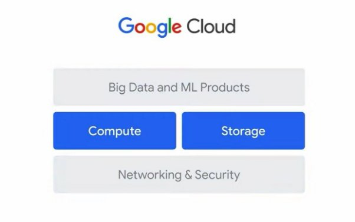

Le Big Data et l'apprentissage automatique sur Google Cloud

Calcul

Concentrons notre attention sur la couche intermédiaire de l'infrastructure Google Cloud, le calcul et le stockage.

Nous allons commencer par le calcul.

Les organisations ayant des besoins croissants en données ont souvent besoin de beaucoup de puissance de calcul pour exécuter

des tâches de Big Data.

Et à mesure que les organisations conçoivent pour l'avenir, le besoin de puissance de calcul ne fait qu'augmenter.

Google propose une gamme de services informatiques. Le premier est Compute Engine.

Compute Engine est une offre IaaS, ou une infrastructure en tant que service, qui fournit

des ressources de calcul, de stockage et de réseau pratiquement similaires aux centres de données physiques.

Vous utilisez les ressources virtuelles de calcul et de stockage de la même manière que vous les gérez localement.

Compute Engine offre une flexibilité maximale pour ceux qui préfèrent gérer eux-mêmes les instances de serveur.

Le second est Google Kubernetes Engine, ou GKE GKE exécute des applications conteneurisées dans

un environnement cloud, par opposition à une machine virtuelle individuelle, comme Compute Engine.

Un conteneur représente le code empaqueté avec toutes ses dépendances.

Le troisième service informatique proposé par Google est App Engine, une offre PaaS entièrement gérée,

ou plate-forme en tant que service.

Les offres PaaS lient le code aux bibliothèques qui permettent d'accéder aux besoins des applications d'infrastructure.

Cela permet de concentrer davantage de ressources sur la logique d'application.

Ensuite, il y a Cloud Functions, qui exécute du code en réponse à des événements, comme lorsqu'un nouveau

le fichier est importé dans Cloud Storage.

Il s'agit d'un environnement d'exécution entièrement sans serveur, ce qui signifie que vous n'avez pas besoin d'installer de

logiciel localement pour exécuter le code et que vous n'avez pas besoin de fournir et de gérer des serveurs.

Cloud Functions est souvent appelé fonctions en tant que service.

Et enfin, il y a Cloud Run, une plate-forme de calcul entièrement gérée qui vous permet d'exécuter des

charges de travail sans état basées sur des requêtes ou des événements sans avoir à vous soucier des serveurs.

Il supprime toute la gestion de l'infrastructure afin que vous puissiez vous concentrer sur l'écriture de code.

Il monte et descend automatiquement à partir de zéro, vous n'avez donc jamais à vous soucier de la configuration de la balance.

Cloud Run ne vous facture que les ressources que vous utilisez afin que vous ne payiez jamais pour des ressources surprovisionnées

Voyons comment Google Photos s'appuie sur la capacité de calcul fournie par Google Cloud pour mettre en œuvre sa stabilisation vidéo. Google Photos propose une fonctionnalité appelée

stabilisation vidéo automatique.

Cela prend une vidéo instable, comme celle capturée à l'arrière d'une moto, et

la stabilise pour minimiser les mouvements.

Regardons un exemple d'une technologie qui nécessite beaucoup de puissance de calcul.

Pour que la stabilité vidéo fonctionne comme prévu, vous avez besoin des données appropriées.

Cela inclut la vidéo elle-même, qui est vraiment une grande collection d'images individuelles, ainsi

que des données de séries chronologiques sur la position et l'orientation de la caméra à partir du gyroscope intégré,

et le mouvement de l'objectif de la caméra. Une courte vidéo peut nécessiter plus d'un milliard de points de données pour alimenter le modèle ML afin de créer une

version stabilisée.

Tout comme le matériel d'un ordinateur personnel standard peut ne pas être assez puissant pour traiter

un travail de Big Data pour une organisation, le matériel d'un smartphone n'est pas assez puissant pour

former des modèles ML sophistiqués.

C'est pourquoi Google forme des modèles d'apprentissage automatique de production sur un vaste réseau de

centres de données, pour ensuite déployer des versions plus petites et formées des modèles sur le smartphone et le

matériel informatique. Mais d'où vient toute cette puissance de traitement ?

Selon le rapport sur l'indice d'IA 2019 de l'Université de Stanford, avant 2012,

les résultats de l'intelligence artificielle suivaient de près la loi de Moore, la puissance de calcul requise utilisée dans

les plus grandes formations à l'IA doublant tous les deux ans.

Le rapport indique que, depuis 2012, la puissance de calcul requise double environ

tous les trois mois et demi.

Cela signifie que les fabricants de matériel se sont heurtés à des limitations et que les processeurs, qui

sont des unités centrales de traitement, et les GPU, qui sont des unités de traitement graphique, ne peuvent plus

évoluer pour répondre de manière adéquate à la demande rapide de ML.

Pour aider à surmonter ce défi, en 2016, Google a introduit le Tensor Processing Unit, ou

TPU.

Les TPU sont des circuits intégrés spécifiques aux applications (ASIC) développés sur mesure par Google et utilisés pour accélérer

les charges de travail d'apprentissage automatique.

Les TPU agissent comme du matériel spécifique à un domaine, par opposition au matériel à usage général avec des CPU et

des GPU.

Cela permet une plus grande efficacité en adaptant l'architecture pour répondre aux besoins de calcul

dans un domaine, comme la multiplication matricielle dans l'apprentissage automatique.

Avec les TPU, la vitesse de calcul est multipliée par plus de 200.

Cela signifie qu'au lieu d'attendre 26 heures pour obtenir des résultats avec un seul GPU à la pointe de la technologie,

vous n'aurez qu'à attendre 7,9 minutes pour qu'un pod Cloud TPU v.2 complet fournisse les

mêmes résultats.

Les Cloud TPU ont été intégrés à tous les produits Google, et ce matériel de pointe et cette technologie de supercalcul sont disponibles avec les produits et services Google Cloud.

Stockage

Accéder à la position de la vidéo dans la transcription

Défilement automatique

Maintenant que nous avons exploré le calcul et pourquoi il est nécessaire pour les tâches de Big Data et de ML, examinons maintenant le stockage.

C'est l'une des principales différences entre l'informatique en nuage et l'informatique de bureau.

Avec le cloud computing, les limitations de traitement ne sont pas liées aux disques de stockage.

La plupart des applications nécessitent une base de données et une solution de stockage quelconque.

Avec Compute Engine, par exemple, qui a été mentionné dans la vidéo précédente, vous pouvez

installer et exécuter une base de données sur une machine virtuelle, comme vous le feriez dans un centre de données.

Alternativement, Google Cloud propose des services de base de données et de stockage entièrement gérés.

Celles-ci incluent : Cloud Storage

Cloud Bigtable Cloud SQL

Cloud Spanner Firestore

et BigQuery L'objectif de ces produits est de réduire le temps et les efforts nécessaires au stockage des données.

Cela signifie créer un bucket de stockage élastique directement dans une interface Web ou via une ligne de commande, par exemple sur Cloud Storage.

Google Cloud propose

des bases de données relationnelles et non relationnelles, ainsi qu'un stockage d'objets dans le monde entier.

Nous explorerons ces options plus en détail bientôt.

Le choix de la bonne option pour stocker et traiter les données dépend souvent du type de données à stocker

et des besoins de l'entreprise.

Commençons par les données non structurées par rapport aux données structurées.

Les données non structurées sont des informations stockées sous une forme non tabulaire, telles que

des documents, des images et

des fichiers audio. Les données non structurées sont généralement adaptées à Cloud Storage, mais BigQuery offre désormais

la possibilité de stocker également des données non structurées.

Cloud Storage est un service géré permettant de stocker des données non structurées. Cloud Storage est un service permettant de stocker vos objets dans Google Cloud.

Un objet est une donnée immuable consistant en un fichier de n'importe quel format.

Vous stockez des objets dans des conteneurs appelés buckets.

Tous les compartiments sont associés à un projet et vous pouvez regrouper vos projets sous une organisation.

Chaque projet, bucket et objet dans Google Cloud est une ressource dans Google Cloud, tout comme

des éléments tels que les instances Compute Engine.

Après avoir créé un projet, vous pouvez créer des buckets Cloud Storage, importer des objets dans votre

buckets et téléchargez des objets à partir de vos buckets.

Quelques exemples incluent la diffusion de contenu de site Web, le stockage de données pour l'archivage et la reprise après sinistre,

et la distribution d'objets de données volumineux aux utilisateurs finaux via le téléchargement direct.

Cloud Storage dispose de quatre classes de stockage principales.

Le premier est le stockage standard.

Le stockage standard est considéré comme le meilleur pour les données fréquemment consultées ou « chaudes ».

Il est également idéal pour les données qui ne sont stockées que pendant de courtes périodes.

La deuxième classe de stockage est Nearline Storage.

C'est mieux pour stocker des données rarement consultées, comme la lecture ou la modification de données une fois

par mois ou moins, en moyenne.

Les exemples incluent les sauvegardes de données, le contenu multimédia à longue traîne ou l'archivage de données.

La troisième classe de stockage est Coldline Storage.

Il s'agit également d'une option peu coûteuse pour stocker les données rarement consultées.

Cependant, par rapport au stockage Nearline, le stockage Coldline est destiné à lire ou à modifier

des données, au plus, une fois tous les 90 jours.

La quatrième classe de stockage est le stockage d'archives.

Il s'agit de l'option la moins coûteuse, idéale pour l'archivage des données, la sauvegarde en ligne et

la reprise après sinistre.

C'est le meilleur choix pour les données auxquelles vous prévoyez d'accéder moins d'une fois par an, car il

a des coûts plus élevés pour l'accès aux données et les opérations et une durée de stockage minimale de 365 jours.

Alternativement, il existe des données structurées, qui représentent des informations stockées dans

des tableaux, des lignes

et des colonnes.

Les données structurées sont de deux types : les charges de travail transactionnelles et les charges de travail analytiques.

Les charges de travail transactionnelles proviennent des systèmes de traitement des transactions en ligne, qui sont utilisés lorsque

des insertions et des mises à jour rapides de données sont nécessaires pour créer des enregistrements basés sur des lignes.

Il s'agit généralement de conserver un instantané du système.

Ils nécessitent des requêtes relativement standardisées qui n'impactent que quelques enregistrements.

Ensuite, il y a les charges de travail analytiques, qui découlent des systèmes de traitement analytique en ligne,

qui sont utilisées lorsque des ensembles de données entiers doivent être lus. Ils nécessitent souvent des requêtes complexes, par exemple des agrégations. Une fois que vous avez déterminé si les charges de travail sont transactionnelles ou analytiques, vous devez

déterminer si les données seront accessibles via SQL ou non.

Ainsi, si vos données sont transactionnelles et que vous devez y accéder à l'aide de SQL, Cloud SQL

et Cloud Spanner sont deux options.

Cloud SQL fonctionne mieux pour l'évolutivité locale à régionale, tandis que Cloud Spanner, il est préférable

de faire évoluer une base de données à l'échelle mondiale.

Si les données transactionnelles seront accessibles sans SQL, Firestore pourrait être la meilleure option.

Firestore est une base de données transactionnelle NoSQL orientée documents.

Si vous avez des charges de travail analytiques qui nécessitent des commandes SQL, BigQuery est probablement la meilleure

option.

BigQuery, la solution d'entrepôt de données de Google, vous permet d'analyser des ensembles de données à l'échelle du pétaoctet.

Cloud Bigtable fournit également une solution NoSQL évolutive pour les charges de travail analytiques.

Il est idéal pour les applications en temps réel à haut débit qui ne nécessitent qu'une latence d'une milliseconde.

L'histoire des produits Big Data et ML

La dernière couche de l'infrastructure Google Cloud qui reste à explorer est celle des produits de big data et d'apprentissage automatique.

Dans cette vidéo, nous examinerons l'évolution des cadres de traitement des données à travers

le prisme du développement de produits.

Comprendre la chronologie des produits peut aider à relever les défis typiques du Big Data et du ML.

Historiquement parlant, Google a rencontré assez tôt des défis liés au Big Data, principalement avec de grands ensembles de données,

des données à évolution rapide et des données variées.

C'était le résultat de la nécessité d'indexer le World Wide Web. Et avec l'essor d'Internet, Google a dû inventer de nouvelles méthodes de traitement des données.

Ainsi, en 2002, Google a publié le système de fichiers Google, ou GFS.

GFS a été conçu pour gérer le partage de données et le stockage en pétaoctets à grande échelle.

Il a servi de base à Cloud Storage et également à ce qui allait devenir la

fonctionnalité de stockage géré dans BigQuery.

Un défi auquel Google était confronté à cette époque était de savoir comment indexer le volume explosif

de contenu sur le Web.

Pour résoudre ce problème, Google a rédigé en 2004 un rapport présentant MapReduce.

MapReduce était un nouveau style de traitement de données conçu pour gérer le traitement de données à grande échelle

sur de grands clusters de serveurs de base.

Alors que Google continuait de croître, de nouveaux défis sont apparus, en particulier avec l'enregistrement et la récupération

de millions d'actions d'utilisateurs en streaming avec un débit élevé.

La solution a été la sortie en 2005 de Cloud Bigtable, un service de base de données NoSQL hautes performances

pour les charges de travail analytiques et opérationnelles importantes.

Avec MapReduce disponible, certains développeurs ont été limités par la nécessité d'écrire du code

pour gérer leur infrastructure, ce qui les a empêchés de se concentrer sur la logique de l'application.

En conséquence, de 2008 à 2010, Google a commencé à s'éloigner de MapReduce en tant que solution

pour traiter et interroger de grands ensembles de données. Ainsi, en 2008, Dremel a été introduit.

Dremel a adopté une nouvelle approche du traitement des mégadonnées en divisant les données en petits morceaux appelés

fragments, puis en les compressant.

Dremel utilise ensuite un optimiseur de requêtes pour partager les tâches entre les nombreux fragments de données et

les centres de données de Google, qui traitaient les requêtes et fournissaient les résultats. La grande innovation a été que Dremel s'est mis à l'échelle automatiquement pour répondre aux demandes de requête.

Dremel est devenu le moteur de requête derrière BigQuery.

Google a continué d'innover pour résoudre les problèmes liés au Big Data et à l'apprentissage automatique.

Certaines des solutions technologiques publiées incluent :

Colossus, en 2010, qui est un système de fichiers au niveau du cluster et successeur du

système de fichiers Google.

BigQuery, en 2010 également, qui est un entrepôt de données entièrement géré et sans serveur qui permet

une analyse évolutive sur des pétaoctets de données.

Il s'agit d'une plate-forme en tant que service (PaaS) qui prend en charge l'interrogation à l'aide de ANSI SQL.

Il dispose également de capacités d'apprentissage automatique intégrées.

BigQuery a été annoncé en mai 2010 et mis à la disposition générale en novembre 2011.

Spanner, en 2012, qui est une base de données relationnelle disponible et évolutive dans le monde entier.

Pub/Sub, en 2015, qui est un service utilisé pour l'analyse en continu et

les pipelines d'intégration de données pour ingérer et distribuer des données.

Et TensorFlow, également en 2015, qui est une bibliothèque de logiciels gratuits et open source pour

l'apprentissage automatique et l'intelligence artificielle.

2018 a vu la sortie de Tensor Processing Unit, ou TPU, dont vous vous souviendrez plus tôt,

et d'AutoML, en tant que suite de produits d'apprentissage automatique.

La liste continue jusqu'à Vertex AI, une plateforme ML unifiée sortie en 2021.

Et c'est grâce à ces technologies que le produit Big Data et Machine Learning la ligne est maintenant robuste.

Cela inclut :

Cloud Storage Dataproc

Cloud Bigtable BigQuery

Dataflow Firestore

Pub/Sub Looker

Cloud Spanner AutoML et

Vertex AI, la plate-forme unifiée Ces produits et services sont mis à disposition

via Google Cloud, et vous obtiendrez une pratique pratique avec certains d'entre eux dans le cadre de ce

cours.

Catégories de produits Big Data et ML

Comme nous l'avons vu dans la dernière vidéo,

Google propose

une gamme de produits de big data et d'apprentissage automatique.

Alors, comment savoir ce qui convient le mieux aux besoins de votre entreprise ? Examinons de plus près la liste des produits, qui peuvent être divisés en quatre catégories générales

le long

du flux de travail data-to-AI :

ingestion et processus,

stockage,

analyse et

apprentissage automatique.

Comprendre ces catégories de produits peut vous aider à affiner votre choix.

La première catégorie est l'ingestion et le processus, qui incluent les produits utilisés pour digérer

à la fois les données en temps réel et les données par lots.

La liste comprend

Pub/Sub

Dataflow

Dataproc

Cloud Data Fusion

Plus loin dans ce cours, vous découvrirez comment Dataflow et Pub/Sub peuvent ingérer des données de streaming.

La deuxième catégorie de produits est le stockage de données, et vous vous rappellerez qu'il existe

cinq produits de stockage :

Cloud Storage

Cloud SQL

Cloud Spanner

Cloud Bigtable et

Firestore

Cloud SQL et Cloud Spanner sont des bases de données relationnelles, tandis que Bigtable et Firestore sont des bases de données NoSQL.

La troisième catégorie de produits est l'analyse.

Le principal outil d'analyse est BigQuery.

BigQuery est un entrepôt de données entièrement géré qui peut être utilisé pour analyser des données via

des commandes SQL.

En plus de BigQuery, vous pouvez analyser les données et visualiser les résultats à l'aide de :

Looker et

Looker Studio.

Vous découvrirez BigQuery, Looker et Looker Studio dans ce cours.

Et la catégorie de produit final est l'apprentissage automatique, ou ML.

Les produits ML incluent à la fois la plate-forme de développement ML et les solutions d'IA :

le produit principal de la plate-forme de développement ML est Vertex AI, qui comprend les produits et technologies :

AutoML

Vertex AI Workbench et les solutions TensorFlow

AI sont basées sur la plate-forme de développement ML et incluent produits de pointe

pour répondre aux besoins du marché horizontal et vertical.

Celles-ci incluent :

Document AI

Contact Center AI

Retail Product Discovery et

Healthcare Data Engine

Ces produits libèrent des informations que seules de grandes quantités de données peuvent fournir. Nous explorerons plus en détail

les options d'apprentissage automatique et le flux de travail avec ces produits plus tard.

[Hand-on](https://www.cloudskillsboost.google/course_sessions/3719343/labs/374753)
