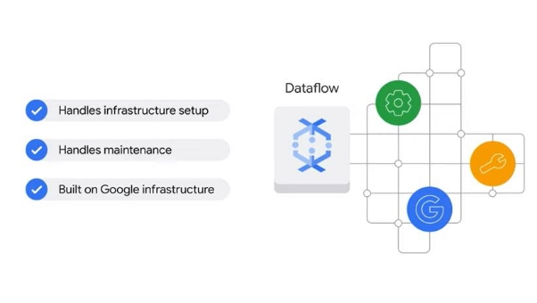

# Ingénierie des données pour les données en continu

## Défis du big data.

La création de pipelines évolutifs et

fiables est une responsabilité essentielle des ingénieurs de données.

Cependant, dans les organisations modernes,

Ceux-ci sont collectivement connus sous le nom de 4 V. Ce sont la variété,

le volume, la vélocité et

la véracité.

Premièrement, les données peuvent provenir de diverses sources et sous divers formats.

Imaginez des centaines de milliers de capteurs pour les voitures autonomes sur les routes du monde entier.

Les données sont renvoyées dans divers formats tels que

nombre, image ou même

audio.

Considérons maintenant les données de point de vente d'un millier de magasins différents.

Comment alerter nos systèmes en aval des nouvelles transactions de manière organisée et sans doublons ?

Ensuite, augmentons l'ampleur du défi pour gérer non

seulement une variété arbitraire de sources d'entrée, mais

un volume de données qui varie de gigaoctets à pétaoctets.

Vous aurez besoin de savoir

si votre code de pipeline et votre infrastructure peuvent évoluer avec ces changements ou s'ils

vont s'arrêter ou même tomber en panne.

Le troisième défi concerne la vélocité.

Les données doivent souvent être traitées en temps quasi réel,

dès qu'elles parviennent au système.

Vous aurez probablement aussi besoin d'un moyen de gérer les données qui

arrivent en retard, qui contiennent des données erronées dans le message,

ou doit être transformé en cours de vol avant d'être diffusé dans un entrepôt de données.

Et le quatrième défi majeur est la véracité, qui fait référence à la qualité des données.

Étant donné que le Big Data implique une multitude de dimensions de données résultant

de différents types et

sources de données, il est possible que les données recueillies comportent

des incohérences et

des incertitudes.

Des défis comme ceux-ci sont des considérations courantes pour les développeurs de pipelines.

À la fin de cette section, l'objectif est que vous compreniez mieux les outils disponibles

pour vous aider à créer avec succès un pipeline de données en continu et à éviter ces défis.

## L'architecture orientée messages

L'une des premières étapes d'un pipeline de données est l'ingestion de données, où de grandes quantités

de données en continu sont reçues.

Cependant, les données ne proviennent pas toujours d'une seule base de données structurée.

Au lieu de cela, les données peuvent provenir d'un millier, voire d'un million, d'événements différents qui se

produisent tous de manière asynchrone.

Un exemple courant de ceci est les données des applications IoT, ou Internet des objets.

Ceux-ci peuvent inclure des capteurs sur les taxis qui envoient des données de localisation toutes les 30 secondes ou

des capteurs de température autour d'un centre de données pour aider à optimiser le chauffage et le refroidissement.

Ces appareils IoT présentent de nouveaux défis pour l'ingestion de données, qui peuvent être résumés en

quatre points : le premier est que les données peuvent être diffusées à partir de nombreuses méthodes et appareils différents,

dont beaucoup peuvent ne pas se parler et envoyer des données erronées ou retardées. La seconde est qu'il peut être difficile de distribuer des messages d'événement aux bons abonnés.

Les messages d'événement sont des notifications.

Une méthode est nécessaire pour collecter les messages en streaming provenant des capteurs IoT et

les diffuser aux abonnés selon les besoins.

La troisième est que les données peuvent arriver rapidement et en grande quantité. Les services doivent pouvoir le supporter.

Et le quatrième défi consiste à s'assurer que les services sont fiables, sécurisés et fonctionnent comme prévu.

Google Cloud dispose d'un outil pour gérer les architectures orientées message distribuées à grande échelle, et

c'est Pub/Sub.

Le nom est l'abréviation de Publisher/Subscriber, ou publier des messages aux abonnés.

Pub/Sub est un service de messagerie distribué qui peut recevoir des messages provenant de divers

flux d'appareils tels que des événements de jeu, des appareils IoT et des flux d'applications.

Il garantit au moins une livraison des messages reçus aux applications abonnées, sans provisionnement requis.

Les API de Pub/Sub sont ouvertes, le service est global par défaut et offre un

chiffrement de bout en bout.

Explorons l'architecture de bout en bout à l'aide de Pub/Sub.

Explorons l'architecture de bout en bout à l'aide de Pub/Sub.

Les données source en amont proviennent d'appareils du monde entier et sont ingérées dans Pub/Sub,

qui est le premier point de contact au sein du système.

Pub/Sub lit, stocke et diffuse à tous les abonnés de cette rubrique de données que de nouveaux messages sont disponibles.

En tant qu'abonné Pub/Sub, Dataflow peut ingérer et transformer ces messages dans un

pipeline de streaming élastique et générer les résultats dans un entrepôt de données d'analyse comme BigQuery.

Enfin, vous pouvez connecter un outil de visualisation de données, comme Looker, pour visualiser et surveiller

les résultats d'un pipeline, ou un outil d'IA ou de ML tel que Vertex AI pour explorer les données afin

de découvrir des informations commerciales ou d'aider aux prévisions. Un élément central de Pub /Sub est le sujet.

Vous pouvez penser à un sujet comme une antenne radio.

Que votre radio diffuse de la musique ou qu'elle soit éteinte, l'antenne elle-même est toujours là.

Si de la musique est diffusée sur une fréquence que personne n'écoute, le flux de musique existe toujours.

De même, un éditeur peut envoyer des données à un sujet qui n'a pas d'abonné pour les recevoir.

Ou un abonné peut attendre des données d'un sujet qui ne reçoit pas de données

, comme écouter de la statique à partir d'une mauvaise fréquence radio.

Ou vous pourriez avoir un pipeline entièrement opérationnel où l'éditeur envoie des données à un sujet

auquel une application est abonnée.

liés à un sujet.

Et ils sont complètement découplés, ils sont donc libres de casser sans affecter leurs homologues.

Il est utile de décrire cela à l'aide d'un exemple.

Supposons que vous ayez un sujet sur les ressources humaines.

Un nouvel employé rejoint votre entreprise et plusieurs applications de l'entreprise doivent être

mises à jour.

L'ajout d'un nouvel employé peut être un événement qui génère une notification aux autres applications

abonnées au sujet, et elles recevront le message concernant le nouvel employé

qui commence.

Supposons maintenant qu'il existe deux types d'employés différents : un employé à temps plein et

un entrepreneur.

Les deux sources de données sur les employés pourraient ne pas se connaître, mais publier quand même leurs

événements en disant "cet employé a rejoint" dans le sujet Pub/Sub HR.

Une fois que Pub/Sub a reçu le message, les applications en aval telles que le service d'annuaire, les installations

système, de provisionnement de compte et d'activation de badge peuvent tous écouter et traiter leurs propres

étapes suivantes indépendamment les unes des autres.

Pub/Sub est une bonne solution pour mettre en mémoire tampon les modifications pour les architectures légèrement couplées, comme celle-ci

, qui ont de nombreux éditeurs et abonnés différents.

Pub/Sub prend en charge de nombreuses entrées et sorties différentes, et vous pouvez même publier un

événement Pub/Sub d'un sujet à un autre.

La tâche suivante consiste à transférer ces messages de manière fiable dans notre entrepôt de données, et nous aurons besoin

d'un pipeline qui peut correspondre à l'échelle et à l'élasticité de Pub/Sub pour le faire.

## Conception de pipelines de streaming avec Apache Beam

Une fois les messages capturés à partir des sources d'entrée de diffusion en continu, vous avez besoin d'un moyen de diriger ces données vers un entrepôt de données pour analyse.

C'est là qu'intervient Dataflow.

Dataflow crée un pipeline pour traiter à la fois les données en continu et

les données par lots.

« Processus » dans ce cas fait référence aux étapes d'extraction, de transformation et de chargement des données, ou ETL.

Lors de la création d'un pipeline de données, les ingénieurs de données rencontrent souvent des difficultés liées au

codage de la conception du pipeline et à la mise en œuvre et

au service du pipeline à grande échelle. Au cours de la phase de conception du pipeline, quelques questions doivent être prises en compte :

le code du pipeline sera-t-il compatible avec les données par lots et en continu, ou sera-t-il besoin d'être refactorisé?

Le kit de développement logiciel de code de pipeline, ou SDK, utilisé aura-t-il toutes les transformations,

les agrégations en cours de vol et le fenêtrage et sera-t-il capable de gérer les données tardives ?

Existe-t-il des modèles ou des solutions existantes qui devraient être référencées ?

Une solution populaire pour la conception de pipelines est Apache Beam.

Il s'agit d'un modèle de programmation unifié open source pour définir et exécuter

des pipelines de traitement de données, y compris le traitement ETL, par lots et par flux.

Apache Beam est unifié, ce qui signifie qu'il utilise un modèle de programmation unique pour les données par lots et en continu.

Il est portable, ce qui signifie qu'il peut fonctionner sur plusieurs environnements d'exécution, comme Dataflow

et Apache Spark, entre autres.

Et il est extensible, ce qui signifie qu'il vous permet d'écrire et de partager vos propres connecteurs

et bibliothèques de transformation.

Apache Beam fournit des modèles de pipeline, vous n'avez donc pas besoin de créer un pipeline à partir de

rien.

Et il peut écrire des pipelines en Java, Python ou Go.

Le kit de développement logiciel Apache Beam, ou SDK, est une collection d'

outils de développement logiciel dans un package installable.

Il fournit une variété de bibliothèques pour les transformations et les connecteurs de données vers les sources et les récepteurs.

Apache Beam crée une représentation de modèle à partir de votre code qui est portable sur de nombreux

exécuteurs.

Les coureurs transmettent votre modèle pour une exécution sur une variété de différents moteurs possibles,

Dataflow étant un choix populaire.

## Mise en œuvre de pipelines de streaming sur Cloud Dataflow.

Comme indiqué dans la vidéo précédente, Apache Beam peut être utilisé pour créer des pipelines de traitement de données.

L'étape suivante consiste à identifier un moteur d'exécution pour implémenter ces pipelines.

Lors du choix d'un moteur d'exécution pour votre code de pipeline, il peut être utile de se poser les questions suivantes :

Combien de temps de maintenance cela implique-t-il ? L'infrastructure est-elle fiable ?

Comment la mise à l'échelle du pipeline est-elle gérée ? Comment surveiller le pipeline ?

Le pipeline est-il lié à un fournisseur de services spécifique ?

Cela nous amène à Dataflow.

Dataflow est un service entièrement géré permettant d'exécuter des pipelines Apache Beam au sein de l'

écosystème Google Cloud.

Dataflow gère une grande partie de la complexité liée à l'infrastructure d'installation et de maintenance

et repose sur l'infrastructure de Google.

Cela permet une mise à l'échelle automatique fiable pour

répondre aux demandes de pipeline de données.

Dataflow est sans serveur et NoOps, ce qui signifie aucune opération. Mais qu'est-ce que cela signifie exactement ?

Un environnement NoOps est un environnement qui ne nécessite pas de gestion par une

équipe d'exploitation,

car la maintenance, la surveillance et la mise à l'échelle

sont automatisées.

L'informatique sans serveur est un modèle d'exécution de l'informatique en nuage.

C'est lorsque Google Cloud, par exemple, gère les tâches d'infrastructure pour le compte des

utilisateurs.

Cela inclut des tâches telles que le provisionnement des ressources, le réglage des performances

et la garantie de la fiabilité du pipeline.

Le flux de données signifie que vous pouvez passer plus de temps à analyser les informations de vos

ensembles de données et moins de temps à provisionner des ressources pour vous assurer que votre pipeline terminera avec succès ses prochains cycles.

Il est conçu pour nécessiter peu d'entretien.

Explorons les tâches que Dataflow effectue lorsqu'une tâche est reçue.

Il commence par optimiser le graphique d'exécution d'un modèle de pipeline pour supprimer toute inefficacité.

Ensuite, il planifie le travail distribué aux nouveaux travailleurs et

évolue selon les besoins.

Après cela, il répare automatiquement tous les défauts du travailleur.

À partir de là, il rééquilibre automatiquement les efforts pour utiliser plus efficacement ses travailleurs.

Et enfin, il sort des données pour produire un résultat.

BigQuery est l'une des nombreuses options vers lesquelles les données peuvent être générées.

Vous vous exercerez davantage à utiliser BigQuery plus tard dans ce cours.

Ainsi, de par sa conception, vous n'avez pas besoin de surveiller toutes les ressources de calcul et de stockage gérées par

Dataflow, pour répondre à la demande d'un pipeline de flux de données.

Même les développeurs Java ou Python expérimentés tireront profit

des modèles Dataflow, qui couvrent les cas d'utilisation courants

des produits Google Cloud.

La liste des modèles ne cesse de s'allonger.

Ils peuvent être divisés en trois catégories :

les modèles de diffusion en continu, les modèles de lot et

les modèles d'utilitaires.

Les modèles de streaming sont destinés au traitement de données continues ou en temps réel.

Par exemple : Pub/Sub vers BigQuery

Pub/Sub vers Cloud Storage Datastream vers BigQuery

Pub/Sub vers MongoDB

Les modèles de lot sont destinés au traitement des données en masse ou des données de chargement par lot.

Par exemple : BigQuery vers Cloud Storage

Bigtable vers Cloud Storage Cloud Storage vers BigQuery

Cloud Spanner vers Cloud Storage

Enfin, les modèles d'utilitaire traitent des activités liées à la compression, la suppression et

la conversion en bloc.

Pour une liste complète des modèles, veuillez vous référer à la liste de lecture.

## Visualisation avec Looker

Raconter une bonne histoire

avec des données via un tableau de bord peut être essentiel

au succès d'un pipeline de données, car des données

difficiles à interpréter ou

à partir desquelles tirer des informations peuvent être inutiles.

Une fois les données

dans BigQuery,

beaucoup de compétences et d'efforts

peuvent encore être nécessaires

pour découvrir des informations.

Pour aider à créer un environnement dans lequel les parties prenantes peuvent

facilement interagir avec les données et les visualiser, Google Cloud propose deux solutions Looker

et Looker Studio.

Explorons les deux,

en commençant par Looker.

Looker prend en charge BigQuery,

ainsi que

plus de 60 bases de données SQL différentes.

Il permet aux développeurs de définir

une couche de modélisation sémantique au-dessus des

bases de données utilisant

Looker Modeling Language, ou LookML.

LookML

définit la logique et les autorisations indépendamment d'une base de données spécifique ou d'un langage SQL,

ce qui évite à un ingénieur de données d'interagir avec des bases de données individuelles pour se concentrer davantage sur

la logique métier au sein d'une organisation.

La plateforme Looker est 100 % Web, ce qui facilite son

intégration dans les flux de travail existants et

son partage avec plusieurs équipes d'une organisation.

Il existe également une API Looker, qui peut être utilisée pour intégrer des rapports Looker dans d'autres applications.

Explorons certaines des fonctionnalités de Looker, en commençant par les tableaux de bord.

Les tableaux de bord, comme le tableau de bord Business Pulse, par exemple, peuvent visualiser les données d'une manière qui

rend les informations faciles à comprendre.

Pour une organisation commerciale, il affiche des chiffres que beaucoup pourraient vouloir voir au début de

la semaine, comme le nombre de nouveaux utilisateurs acquis, les tendances mensuelles des ventes et même le nombre

de commandes depuis le début de l'année.

De telles informations peuvent aider à aligner les équipes, à identifier les frustrations des clients et peut-être

même à découvrir les pertes de revenus.

Sur la base des mesures importantes pour votre entreprise, vous pouvez créer des tableaux de bord Looker

qui fournissent des présentations simples pour vous aider, vous et vos collègues, à voir rapidement

un statut commercial de haut niveau.

Looker propose plusieurs options de visualisation des données, notamment graphiques en aires,

graphiques linéaires,

diagrammes Sankey,

entonnoirs

et jauges de remplissage de liquide.

Pour partager un tableau de bord avec votre équipe,

vous planifiez la livraison via des services de stockage tels que

Google Drive

Slack

Dropbox.

## Visualisation avec Data Studio

Un autre outil de visualisation de données populaire proposé par Google est Looker Studio.

Looker Studio est intégré à BigQuery, ce qui permet la visualisation des données en quelques clics seulement.

Cela signifie que l'utilisation de Looker Studio

ne nécessite pas l'assistance d'un administrateur pour établir une connexion de données, ce qui est une

exigence avec Looker.

Les tableaux de bord Looker Studio sont largement utilisés dans de nombreux produits et applications Google.

Par exemple, Looker Studio est intégré à Google Analytics pour aider à visualiser, dans ce

cas, un résumé d'un site Web marketing.

Ce tableau de bord visualise le nombre total de visiteurs sur une carte, compare les tendances d'un mois à l'autre

et affiche même la répartition des visiteurs par âge.

Une autre intégration de Looker Studio est le tableau de bord de facturation de Google Cloud.

Vous le connaissez peut-être depuis votre compte.

Peut-être l'avez-vous déjà utilisé pour surveiller les dépenses, par exemple.

Vous aurez bientôt une pratique pratique avec Looker Studio, mais en préparation pour le laboratoire, explorons les trois étapes nécessaires pour créer un tableau de bord Looker Studio.

Tout d'abord, choisissez un modèle.

Vous pouvez commencer avec un modèle prédéfini ou un rapport vierge. Deuxièmement, liez le tableau de bord à une source de données.

Cela peut provenir de BigQuery, d'un fichier local ou d'une application Google telle que Google Sheets

ou Google Analytics, ou d'une combinaison de l'une de ces sources. Et troisièmement, explorez votre tableau de bord !

[Hand-on](https://www.cloudskillsboost.google/course_sessions/3719343/labs/374777)
