# Big Data avec BigQuery

## Introduction

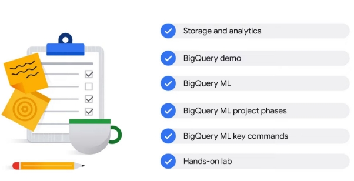

Dans la section précédente de ce cours, vous avez exploré Dataflow et Pub/Sub, les solutions de Google Cloud

pour le traitement des flux de données.

Concentrons maintenant votre attention sur BigQuery.

Vous commencerez par explorer les deux principaux services de BigQuery, le stockage et l'analyse, puis

vous assisterez à une démonstration de l'interface utilisateur de BigQuery.

Après cela, vous verrez comment BigQuery ML fournit un cycle de vie des données à l'IA en un seul endroit.

Vous découvrirez également les phases du projet BigQuery ML, ainsi que les raccourcis clavier.

Enfin, vous vous exercerez à utiliser BigQuery ML pour créer un modèle de ML personnalisé.

Commençons.

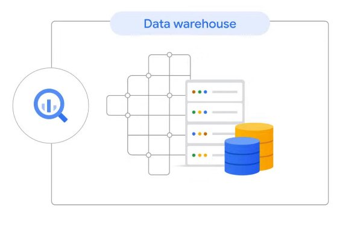

BigQuery est un entrepôt de données entièrement géré.

Un entrepôt de données est un grand magasin contenant des téraoctets et des pétaoctets de données recueillies à partir de

un large éventail de sources au sein d'une organisation, qui est utilisé pour guider les décisions de gestion.

À ce stade, il est utile d'examiner quelle est la principale différence entre un entrepôt de données

et un lac de données.

Un lac de données n'est qu'un pool de données brutes, non organisées et non classifiées, qui n'a pas d'

objectif précis.

Un entrepôt de données, quant à lui, contient des données structurées et organisées, qui peuvent être

utilisées pour des requêtes avancées.

Être entièrement géré signifie que BigQuery s'occupe de l'infrastructure sous-jacente. Vous pouvez ainsi vous concentrer sur l'utilisation de requêtes SQL pour répondre aux questions commerciales, sans vous soucier du

déploiement, de l'évolutivité et de la sécurité.

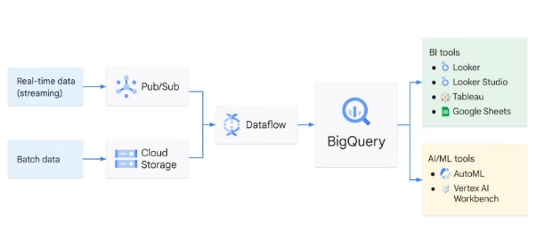

Examinons quelques-unes des principales fonctionnalités de BigQuery. BigQuery fournit deux services en un : le stockage et l'analyse.

C'est un endroit pour stocker des pétaoctets de données.

Pour référence, 1 pétaoctet équivaut à 11 000 films en qualité 4k.

BigQuery est également un lieu d'analyse des données, avec des fonctionnalités intégrées telles que l'apprentissage automatique,

l'analyse géospatiale et l'intelligence économique, que nous verrons un peu plus tard.

BigQuery est une solution sans serveur entièrement gérée, ce qui signifie que vous n'avez pas à vous soucier de

provisionner des ressources ou de gérer des serveurs dans le backend, mais que vous vous concentrez uniquement sur l'utilisation

de requêtes SQL pour répondre aux questions de votre organisation dans le frontend.

Si vous n'avez jamais écrit SQL auparavant, ne vous inquiétez pas.

Ce cours fournit des ressources et des laboratoires pour vous aider.

BigQuery propose un modèle de tarification flexible à l'utilisation dans lequel vous payez pour le nombre d'octets

de données que votre requête traite et pour tout stockage de table permanent.

Si vous préférez avoir une facture fixe chaque mois, vous pouvez également vous abonner à une tarification forfaitaire

où vous disposez d'une quantité réservée de ressources à utiliser.

Les données dans BigQuery sont chiffrées au repos par défaut sans aucune action requise de la part d'un client.

Par chiffrement au repos, nous entendons le chiffrement utilisé pour protéger les données stockées sur un disque,

y compris les disques SSD ou les supports de sauvegarde.

BigQuery intègre des fonctionnalités de machine learning qui vous permettent d'écrire des modèles de ML directement dans BigQuery

à l'aide de SQL.

De plus, si vous décidez d'utiliser d'autres outils professionnels, tels que Vertex AI de Google Cloud, pour

entraînez vos modèles ML, vous pouvez exporter des ensembles de données de BigQuery directement vers Vertex AI pour

une intégration transparente tout au long du cycle de vie des données vers l'IA.

Alors, à quoi ressemble une architecture de solution d'entrepôt de données typique ? Les données d'entrée peuvent être des données en temps réel ou des données par lots. Si vous vous souvenez du dernier module où nous avons discuté des quatre défis du Big Data,

dans les organisations modernes, les données peuvent être dans n'importe quel format (variété), n'importe quelle taille (volume), n'importe quelle

vitesse (vélocité) et éventuellement inexactes (véracité).

S'il s'agit de données en continu, qui peuvent être structurées ou non structurées, à haut débit et en

grand volume,

Pub/Sub est nécessaire pour digérer les données.

S'il s'agit de données par lots, elles peuvent être directement importées dans Cloud Storage.

Après cela, les deux pipelines mènent à Dataflow pour traiter les données.

C'est là que nous ETL – extrayons, transformons et chargeons – les données si nécessaire.

BigQuery se situe au milieu pour lier les processus de données à l'aide de Dataflow et l'accès aux données via

des outils d'analyse, d'IA et de ML.

Le travail du moteur d'analyse de BigQuery à la fin d'un pipeline de données consiste à ingérer

toutes les données traitées après l'ETL, à les stocker et à les analyser, et éventuellement à les sortir pour une

utilisation ultérieure, telle que la visualisation des données et l'apprentissage automatique. Les sorties BigQuery alimentent généralement deux compartiments : les outils d'informatique décisionnelle et les outils d'IA/ML.

Si vous êtes un analyste commercial ou un analyste de données, vous pouvez vous connecter à des outils de visualisation tels que

Looker, Looker Studio, Tableau ou d'autres outils de BI.

Si vous préférez travailler dans des feuilles de calcul, vous pouvez interroger des ensembles de données BigQuery petits ou grands

directement à partir de Google Sheets et même effectuer des opérations courantes comme des tableaux croisés dynamiques.

Si vous êtes un data scientist ou un ingénieur en machine learning, vous pouvez également appeler directement les données de BigQuery via AutoML ou Workbench.

Ces outils AI/ML font partie de Vertex AI, la plateforme ML unifiée de Google.

BigQuery est comme une zone de transit commune pour les charges de travail d'analyse de données.

Lorsque vos données sont là, les analystes commerciaux, les développeurs BI, les scientifiques des données et

les ingénieurs en apprentissage automatique peuvent avoir accès à vos données pour leurs propres informations.

## Stockage et analyse

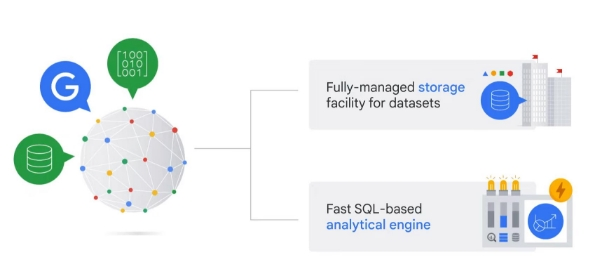

BigQuery fournit deux services en un.

Il s'agit à la fois d'une installation de stockage entièrement gérée pour charger et stocker des ensembles de données,

et également d'un moteur d'analyse rapide basé sur SQL.

Les deux services sont connectés par le réseau interne haut débit de Google.

C'est ce réseau ultra-rapide qui permet à BigQuery de faire évoluer à la fois

le stockage et le calcul indépendamment, en fonction de la demande.

Voyons comment BigQuery gère le stockage et les métadonnées des ensembles de données.

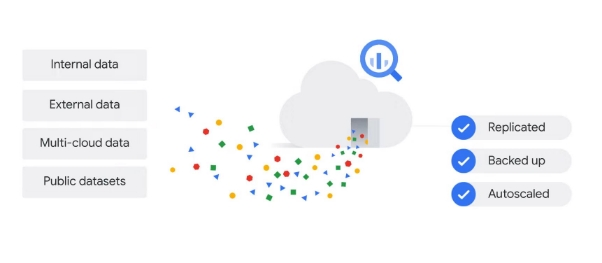

BigQuery peut ingérer des ensembles de données provenant de différentes sources, y compris des données internes, qui sont des données enregistrées directement dans BigQuery, des données externes, des données multicloud

et des ensembles de données publics.

Une fois les données stockées dans BigQuery, elles sont entièrement gérées par BigQuery et sont automatiquement

répliqué, sauvegardé et configuré pour une mise à l'échelle automatique.

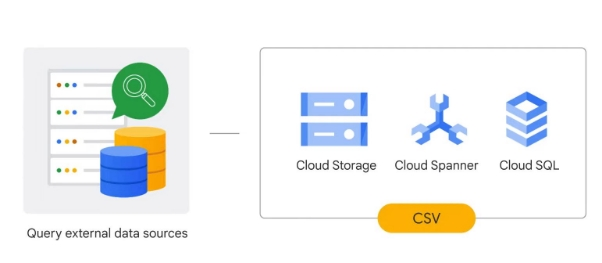

BigQuery offre également la possibilité d'interroger des sources de données externes, telles que les données stockées dans d'autres

services de stockage Google Cloud tels que Cloud Storage, ou dans d'autres services de base de données Google Cloud

tels que Spanner ou Cloud SQL, et de contourner le stockage géré par BigQuery.

Cela signifie qu'un fichier CSV brut dans Cloud Storage ou une feuille de calcul Google peut être utilisé pour écrire une requête

sans être ingéré par BigQuery au préalable.

Une chose à noter ici : une incohérence peut résulter de l'enregistrement et du traitement des données séparément.

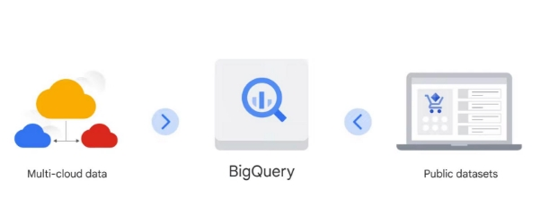

Pour éviter ce risque, envisagez d'utiliser Dataflow pour créer un pipeline de flux de données dans BigQuery.

En plus des sources de données internes/natives et externes, BigQuery peut également ingérer des données

de : données multi-cloud, qui sont des données stockées dans

plusieurs services cloud, tels qu'AWS ou Azure.

Un jeu de données public.

Si vous ne disposez pas de vos propres données, vous pouvez analyser n'importe lequel des ensembles de données disponibles sur le

marché public des ensembles de données.

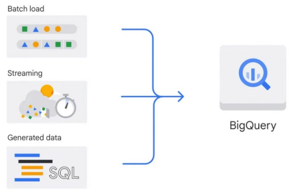

Il existe trois modèles de base pour charger des données dans BigQuery.

Le premier est un chargement par lots, où les données sources sont chargées dans une table BigQuery en une seule

opération par lots.

Il peut s'agir d'une opération ponctuelle ou elle peut être automatisée pour se produire selon un calendrier.

Une opération de chargement par lots peut créer une nouvelle table ou ajouter des données dans une table existante.

Le second est le streaming, où de plus petits lots de données sont diffusés en continu afin que

les données soient disponibles pour interrogation en temps quasi réel.

Et le troisième est les données générées, où les instructions SQL sont utilisées pour insérer des lignes dans une

table existante ou pour écrire les résultats d'une requête dans une table.

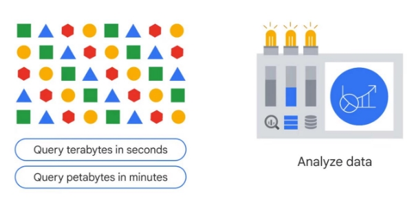

Bien sûr, le but de BigQuery n'est pas seulement de sauvegarder des données ;

c'est pour analyser les données et aider à prendre des décisions commerciales.

BigQuery est optimisé pour exécuter des requêtes analytiques sur de grands ensembles de données.

Il peut effectuer des requêtes sur des téraoctets de données en quelques secondes et sur des pétaoctets en quelques minutes.

Ces performances vous permettent d'analyser efficacement de grands ensembles de données et d'obtenir des informations en

temps quasi réel.

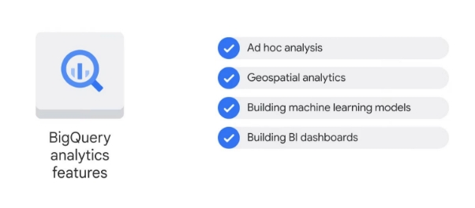

Examinons les fonctionnalités d'analyse disponibles dans BigQuery.

BigQuery prend en charge : l'analyse ad hoc à l'aide de SQL standard, le dialecte SQL de BigQuery.

Analyse géospatiale à l'aide de types de données géographiques et de fonctions géographiques SQL standard.

Créer des modèles de machine learning à l'aide de BigQuery ML.

Créer des tableaux de bord décisionnels riches et interactifs à l'aide de BigQuery BI Engine.

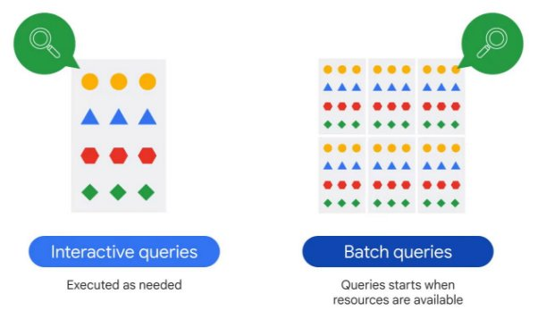

Par défaut, BigQuery exécute des requêtes interactives, ce qui signifie que les requêtes sont exécutées

selon les besoins.

BigQuery propose également des requêtes par lots, où chaque requête est mise en file d'attente en votre nom et la

requête démarre lorsque des ressources inactives sont disponibles, généralement en quelques minutes.

Ensuite, vous verrez une démonstration dans BigQuery.

Veuillez noter que vous remarquerez peut-être une interface utilisateur légèrement différente.

## Introduction à BigQuery ML

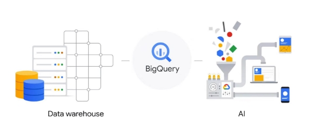

Bien que BigQuery ait commencé uniquement comme un entrepôt de données, il a évolué au fil du temps

pour fournir des fonctionnalités qui prennent en charge le cycle de vie des données à l'IA.

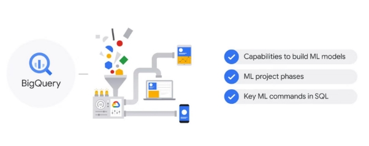

Dans cette section du cours, nous allons explorer les capacités de BigQuery pour créer des modèles de machine learning et les phases de projet de ML, et vous présenter les principales commandes de ML dans

SQL.

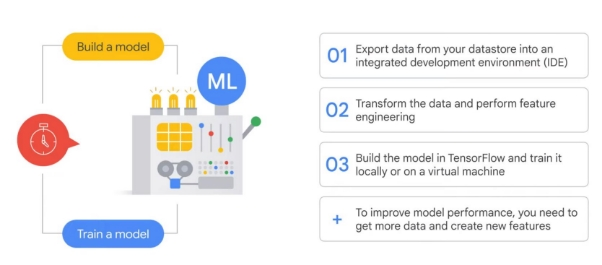

Si vous avez déjà travaillé avec des modèles ML, vous savez que leur création et leur formation peuvent

prendre beaucoup de temps.

Vous devez d'abord exporter les données de votre magasin de données vers un IDE (environnement de développement intégré)

tel que Jupyter Notebook ou Google Colab, puis transformer les données et effectuer toutes vos

étapes d'ingénierie de fonctionnalités avant de pouvoir les intégrer dans un modèle de formation.

Enfin, vous devez créer le modèle dans TensorFlow, ou une bibliothèque similaire, et

l'entraîner localement sur votre ordinateur ou sur une machine virtuelle.

Pour améliorer les performances du modèle, vous devez également faire des allers-retours pour obtenir plus de données

et créer de nouvelles fonctionnalités.

Ce processus devra être répété, mais il prend tellement de temps que vous vous

arrêterez probablement après quelques itérations.

De plus, nous venons de mentionner TensorFlow et l'ingénierie des fonctionnalités ; Dans le passé, si vous

n'étiez pas familier avec ces technologies, le ML était laissé aux scientifiques des données de votre

équipe et n'était pas disponible pour vous.

Vous pouvez désormais créer et exécuter des modèles de machine learning sur vos ensembles de données structurés dans BigQuery

en quelques minutes seulement à l'aide de requêtes SQL.

Il y a deux étapes nécessaires pour commencer :

Étape 1 : Créez un modèle avec une instruction SQL.

Ici, nous utilisons le jeu de données bikeshare comme exemple.

Étape 2 : Écrivez une requête de prédiction SQL et appelez ml.Predict.

Et c'est tout!

Vous disposez maintenant d'un modèle et pouvez afficher les résultats.

Des étapes supplémentaires peuvent inclure des activités telles que l'évaluation du modèle, mais si vous connaissez

le SQL de base, vous pouvez désormais implémenter ML ; plutôt cool!

BigQuery ML a été conçu pour être simple, comme la création d'un modèle en deux étapes.

Cette simplicité s'étend à la définition des hyperparamètres d'apprentissage automatique, qui

vous permettent d'ajuster le modèle pour obtenir le meilleur résultat d'entraînement.

Les hyperparamètres sont les paramètres appliqués à un modèle avant le début de la formation, comme le

taux d'apprentissage.

Avec BigQuery ML, vous pouvez soit contrôler manuellement les hyperparamètres, soit les transmettre à

BigQuery en commençant par un paramètre d'hyperparamètre par défaut, puis un réglage automatique.

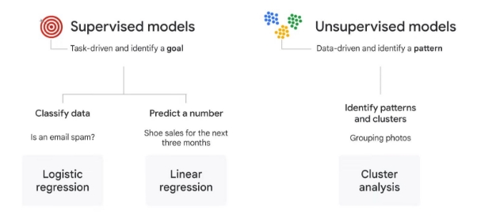Lorsque vous utilisez un ensemble de données structuré dans BigQuery ML, vous devez choisir le type de modèle approprié.

Le choix du type de modèle ML dépend de votre objectif commercial et des ensembles de données.

BigQuery est compatible avec les modèles supervisés et les modèles non supervisés. Les modèles supervisés sont axés sur les tâches et identifient un objectif. Alternativement, les modèles non supervisés sont basés sur les données et identifient un modèle.

Dans un modèle supervisé, si votre objectif est de classer les données, par exemple si un e-mail est un

spam, utilisez la régression logistique.

Si votre objectif est de prédire un nombre, comme les ventes de chaussures pour les trois prochains mois, utilisez

la régression linéaire.

Dans un modèle non supervisé, si votre objectif est d'identifier des modèles ou des grappes, puis

de déterminer la meilleure façon de les regrouper, comme le regroupement d'images aléatoires de fleurs en catégories,

vous devez utiliser l'analyse par grappes.

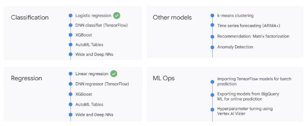

vous devez utiliser l'analyse par grappes.

Une fois que vous avez défini votre problème, il est temps de choisir le meilleur modèle. Les catégories incluent les modèles de classification et de régression.

Il existe également d'autres options de modèle parmi lesquelles choisir, ainsi que des opérations ML.

La régression logistique est un exemple de modèle de classification et la régression linéaire est un exemple

de modèle de régression.

Nous vous recommandons de commencer par ces options et d'utiliser les résultats pour vous comparer

à des modèles plus complexes tels que DNN (réseaux de neurones profonds), dont

l'apprentissage et le déploiement peuvent prendre plus de temps et de ressources informatiques.

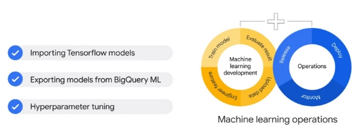

En plus de fournir différents types de modèles de machine learning, BigQuery ML prend en charge

des fonctionnalités permettant de déployer, de surveiller et de gérer la production de ML, appelées ML Ops, qui est l'abréviation

d'opérations de machine learning.

Les options incluent : l'importation de modèles TensorFlow pour la prédiction par lots

l'exportation de modèles à partir de BigQuery ML pour la prédiction en ligne et le réglage des hyperparamètres à l'aide de Vertex AI Vizier.

Nous aborderons plus en détail les opérations ML plus loin dans ce cours.

[Hand-on](https://www.cloudskillsboost.google/course_sessions/3719343/labs/374777)
