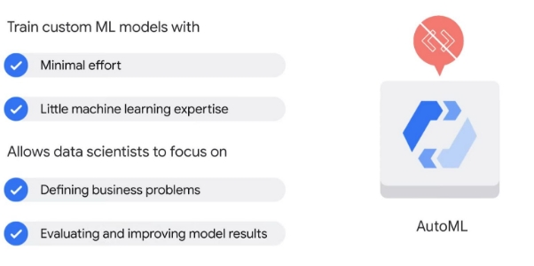

Options d'apprentissage automatique sur Google Cloud

Dans les sections précédentes de ce cours, vous avez découvert de nombreux outils d'ingénierie de données disponibles

sur Google Cloud.

Passons maintenant à l'apprentissage automatique.

Dans cette section, nous allons explorer les différentes options proposées par Google Cloud pour créer

des modèles de machine learning.

De plus, nous expliquerons comment un produit appelé Vertex AI peut aider à résoudre

les problèmes d'apprentissage automatique.

Alors vous vous demandez peut-être : "Pourquoi devrais-je faire confiance à Google pour l'intelligence artificielle et

l'apprentissage automatique ?"

Google est une entreprise axée sur l'intelligence artificielle et est reconnue comme un leader dans tous les secteurs

en raison de ses contributions dans les domaines de l'intelligence artificielle et de l'apprentissage automatique.

En 2022, Google a été reconnu comme un leader dans le Gartner Magic Quadrant pour

les services Cloud AI Developer, et ces dernières années a également été reconnu dans de nombreux prix et rapports annuels de l'industrie.

Et chez Google, nous implémentons l'intelligence artificielle depuis plus de dix ans dans nombre

de nos produits, systèmes et services critiques.

Par exemple, avez-vous déjà remarqué que Gmail propose automatiquement trois réponses à

un message reçu ?

Cette fonctionnalité s'appelle Smart Reply, qui utilise l'intelligence artificielle pour prédire comment

vous pourriez répondre.

Derrière cette intelligence se trouve la technologie d'intelligence artificielle connue sous le nom de traitement du langage naturel, qui

n'est qu'un exemple d'une liste impressionnante de technologies que les scientifiques de Google et

les ingénieurs travaillent dessus.

Nous les explorerons plus en profondeur plus tard dans le cours.

L'objectif de ces technologies n'est pas une utilisation exclusive au profit des seuls clients de Google.

L'objectif est de permettre à chaque entreprise d'être une entreprise d'IA en réduisant les défis de

la création de modèles d'IA aux seules étapes qui nécessitent un jugement humain ou de la créativité.

Ainsi, pour les travailleurs du secteur des voyages et de l'hôtellerie, cela peut signifier utiliser l'IA et le ML pour

améliorer la planification des avions ou fournir aux clients des options de tarification dynamiques.

Pour les employés du secteur de la vente au détail, cela peut signifier utiliser l'IA et le ML pour tirer parti de

la planification prédictive des stocks.

Les solutions potentielles sont infinies.

Quels sont les problèmes de votre entreprise que l'intelligence artificielle et l'apprentissage automatique

pourraient vous aider à résoudre ?

Prenez un moment pour réfléchir à cette question avant de passer à la vidéo suivante.

Options pour construire des modèles d'apprentissage automatique.

Google Cloud propose quatre options pour créer des modèles de machine learning.

La première option est BigQuery ML.

Vous vous souviendrez d'une section précédente de ce cours que BigQuery ML est un outil

permettant d'utiliser des requêtes SQL pour créer et exécuter

des modèles de machine learning dans BigQuery.

Si vous avez déjà vos données dans BigQuery et que vos problèmes correspondent aux modèles de ML prédéfinis,

cela pourrait être votre choix.

La deuxième option consiste à utiliser des API prédéfinies, qui sont des interfaces de programmation d'applications.

Cette option vous permet de tirer parti des modèles d'apprentissage automatique qui ont déjà été créés et entraînés par Google. Vous n'avez donc pas besoin de créer vos propres modèles d'apprentissage automatique si vous ne disposez pas de suffisamment de données d'entraînement ou d'apprentissage automatique suffisant.

savoir-faire en interne.

La troisième option est AutoML, qui est une solution sans code, vous pouvez donc créer vos propres modèles d'apprentissage automatique sur Vertex AI via une interface pointer-cliquer.

Et enfin, il existe une formation personnalisée, grâce à laquelle vous pouvez

coder votre propre environnement d'apprentissage automatique, la formation et le déploiement, ce qui

vous donne de la flexibilité et vous permet de contrôler le pipeline ML.

Comparons les quatre options pour vous aider à décider laquelle utiliser pour créer votre

modèle ML.

Veuillez noter que les technologies changent constamment et ceci n'est qu'une brève indication.

Type de données : BigQuery ML ne prend en charge que les données tabulaires,

tandis que les trois autres prennent en charge les données tabulaires, les images, le texte et la vidéo.

Taille des données d'entraînement : les API prédéfinies ne nécessitent aucune

donnée d'entraînement, tandis que BigQuery ML et l'entraînement personnalisé nécessitent une grande quantité de données.

Apprentissage automatique et expertise en codage : les API pré-construites et AutoML sont conviviaux

avec de faibles exigences, tandis que la formation personnalisée a les exigences les plus élevées

et BigQuery ML nécessite que vous compreniez SQL.

Flexibilité pour ajuster les hyperparamètres : pour le moment, vous ne pouvez pas ajuster les hyperparamètres

avec des API prédéfinies ou AutoML, cependant, vous pouvez expérimenter avec des hyperparamètres

à l'aide de BigQueryML et d'une formation personnalisée.

Temps de formation du modèle : les API prédéfinies ne nécessitent pas de temps pour former un

modèle, car elles utilisent directement des modèles prédéfinis de Google.

Le temps de formation d'un modèle pour les trois autres options dépend du projet spécifique. Normalement, l'entraînement personnalisé prend le plus de temps, car il crée le modèle ML à partir de zéro,

contrairement à AutoML et BigQuery ML.

La sélection de la meilleure option dépendra des besoins de votre entreprise et de votre expertise en ML.

Si vos ingénieurs de données, data scientists et analystes de données connaissent SQL et

disposent déjà de vos données dans BigQuery, BigQuery ML vous permet de développer des modèles basés sur SQL.

Si vos utilisateurs professionnels ou vos développeurs ont peu d'expérience en ML, l'utilisation d'API prédéfinies est probablement le meilleur choix.

Les API prédéfinies traitent des tâches perceptuelles courantes telles que la vision, la vidéo et le langage naturel.

Ils sont prêts à l'emploi sans aucune expertise en ML ni effort de développement de modèle.

Si vos développeurs et scientifiques des données souhaitent créer des modèles personnalisés avec vos propres

données de formation tout en passant un minimum de temps à coder, alors AutoML est votre choix.

AutoML fournit une solution sans code pour vous permettre de vous concentrer sur les problèmes métier au lieu

de l'architecture de modèle sous-jacente et du provisionnement ML.

Si vos ingénieurs ML et vos scientifiques des données veulent un contrôle total du flux de travail ML,

la formation personnalisée Vertex AI vous permet de former et de servir des modèles personnalisés avec du code sur Vertex Workbench.

Nous avons déjà exploré BigQuery ML, donc dans les vidéos qui suivent, nous allons explorer les

trois autres options plus en détail.

API pré-construites

De bons modèles d'apprentissage automatique nécessitent de nombreuses données d'entraînement de haute qualité.

Vous devez viser des centaines de milliers d'enregistrements pour former un modèle personnalisé.

Si vous ne disposez pas de ce type de données, les API prédéfinies sont un excellent point de départ.

Des API prédéfinies sont proposées en tant que services.

Dans de nombreux cas, ils peuvent servir de blocs de construction pour créer l'application souhaitée sans

frais ni complexité liés à la création de vos propres modèles.

Ils permettent d'économiser du temps et des efforts pour créer, conserver et former un nouvel ensemble de données afin que vous

puissiez simplement passer directement aux prévisions.

Alors, quelles sont certaines des API prédéfinies ?

Explorons une courte liste.

L'API Speech-to-Text convertit l'audio en texte pour le traitement des données.

L'API Cloud Natural Language reconnaît les parties du discours appelées entités et sentiments.

L'API Cloud Translation convertit le texte d'une langue à une autre.

L'API Text-to-Speech convertit le texte en audio vocal de haute qualité. L'API Vision fonctionne avec et reconnaît le contenu des images statiques.

Et l'API Video Intelligence reconnaît le mouvement et l'action dans la vidéo.

Et Google a déjà beaucoup travaillé pour former ces modèles à l'aide des ensembles de données Google.

Par exemple, l'API Vision est basée sur les ensembles de données d'images de Google

, l'API Speech-to-Text est formée sur

les sous-titres YouTube et l'API Translation est basée sur

la technologie de traduction automatique neuronale de Google.

Vous vous souviendrez que la qualité de l'entraînement d'un modèle dépend de la quantité de données

est disponible pour le former. Comme vous vous en doutez, Google dispose de nombreux chercheurs en images, en texte et en ML pour former ses modèles

prédéfinis . Cela signifie moins de travail pour vous. Prenons une minute et essayons l'API Vision dans un navigateur. (Fournissez une image.) Commencez par accéder à cloud.google.com/vision dans Chrome, puis faites défiler vers le bas pour essayer l'API en téléchargeant une image. Vous pouvez en fait expérimenter chacune des API ML dans un navigateur. Lorsque vous êtes prêt à créer un modèle de production, vous devez transmettre une demande d'objet JSON à l'API et analyser ce qu'elle renvoie.

AutoML

Pour comprendre AutoML, qui est l'abréviation de machine learning automatisé, examinons brièvement comment il a été construit.

Si vous avez déjà travaillé avec des modèles ML, vous savez que la formation et le déploiement de modèles ML

peuvent prendre énormément de temps, car vous devez

ajouter de manière répétée de nouvelles données et fonctionnalités, essayer différents modèles et ajuster les paramètres pour obtenir le meilleur résultat.

Pour résoudre ce problème, lorsque AutoML a été annoncé pour la première fois en janvier 2018, l'objectif était

d'automatiser les pipelines d'apprentissage automatique pour épargner

aux scientifiques des données le travail manuel, comme le réglage des hyperparamètres et la comparaison avec

plusieurs modèles.

Mais comment cela pourrait-il être fait ?

Eh bien, l'apprentissage automatique est similaire à l'apprentissage humain.

Tout commence par la collecte des bonnes informations.

Pour AutoML, deux technologies sont essentielles.

Le premier est connu sous le nom d'apprentissage par transfert.

Avec l'apprentissage par transfert, vous construisez une base de connaissances dans le domaine.

Vous pouvez penser à cela comme rassembler beaucoup de livres

pour créer une bibliothèque.

L'apprentissage par transfert est une technique puissante qui permet aux personnes disposant d'ensembles de données plus petits ou d'une

puissance de calcul moindre d'obtenir des résultats de pointe en tirant parti de

modèles pré-formés qui ont été formés sur des ensembles de données similaires et plus volumineux.

Étant donné que le modèle apprend via l'apprentissage par transfert, il n'a pas besoin d'apprendre à partir de zéro,

il peut donc généralement atteindre une plus grande précision avec beaucoup moins de données et de temps de calcul que modèles qui n'utilisent pas l'apprentissage par transfert.

La deuxième technologie est la recherche d'architecture neuronale.

L'objectif de la recherche d'architecture neuronale est de trouver le modèle optimal pour le projet concerné.

Pensez à cela comme trouver le meilleur livre de la bibliothèque pour vous aider à apprendre ce dont vous avez besoin

.

AutoML s'appuie sur les dernières recherches en matière d'apprentissage automatique. Ainsi, bien qu'un modèle effectue une formation,

la plate-forme AutoML entraîne et évalue en fait plusieurs modèles et les compare les uns aux autres

.

Cette recherche d'architecture neuronale produit un ensemble de modèles ML et choisit le meilleur

.

L'exploitation de ces technologies a produit un outil qui peut bénéficier de manière significative

aux scientifiques des données.

L'un des principaux avantages est qu'il s'agit d'une solution sans code.

Cela signifie qu'il peut former des modèles d'apprentissage automatique personnalisés de haute qualité avec un minimum d'effort

et nécessite peu d'expertise en apprentissage automatique.

Cela permet aux scientifiques des données de concentrer leur temps sur des tâches telles que la définition de problèmes métier

ou l'évaluation et l'amélioration des résultats des modèles.

D'autres pourraient trouver AutoML utile comme outil pour prototyper rapidement des modèles et explorer de nouveaux

ensembles de données avant d'investir dans le développement.

Cela peut signifier l'utiliser pour identifier les meilleures fonctionnalités dans un ensemble de données, par exemple.

Alors, comment fonctionne exactement AutoML ?

AutoML prend en charge quatre types de données : image, tableau, texte et vidéo.

Pour chaque type de données, AutoML résout différents types de problèmes, appelés objectifs.

Pour commencer, importez vos données dans AutoML.

Il peut provenir de Cloud Storage, de BigQuery ou même de votre ordinateur local.

À partir de là, informez AutoML des problèmes que vous souhaitez résoudre.

Certains problèmes peuvent sembler similaires à ceux mentionnés dans les API prédéfinies. Cependant, la principale différence est que les API prédéfinies utilisent des modèles d'apprentissage automatique prédéfinis,

tandis qu'AutoML utilise des modèles personnalisés.

Dans AutoML, vous utilisez vos propres données pour former le modèle de machine learning, puis appliquez

le modèle formé pour prédire votre objectif.

Pour les données d'image :

vous pouvez utiliser un modèle de classification pour analyser les données d'image et renvoyer une liste des catégories de contenu

qui s'appliquent à l'image.

Par exemple, vous pouvez former un modèle qui classe les images comme contenant un chien ou ne

contenant pas de chien, ou vous pouvez former un modèle pour classer les images de chiens par race.

Vous pouvez également utiliser un modèle de détection d'objet pour analyser vos données d'image et renvoyer des annotations

consistant en une étiquette et un emplacement de cadre de délimitation pour chaque objet trouvé dans une image.

Par exemple, vous pouvez former un modèle pour trouver l'emplacement des chiens dans les données d'image.

Pour les données tabulaires :

vous pouvez utiliser un modèle de régression pour analyser les données tabulaires et renvoyer une valeur numérique.

Par exemple, vous pouvez former un modèle pour estimer la valeur ou le prix de location d'une maison en fonction d'

un ensemble de facteurs tels que l'emplacement, la taille de la maison et le nombre de chambres.

Vous pouvez utiliser un modèle de classification pour analyser les données tabulaires et renvoyer une liste de catégories.

Par exemple, vous pouvez former un modèle pour classer différents types de terrains en potentiels élevés, médians et faibles pour l'immobilier commercial.

Et un modèle de prévision peut utiliser plusieurs lignes de données tabulaires dépendant du temps du passé

pour prédire une série de valeurs numériques dans le futur.

Par exemple, vous pouvez utiliser les données historiques et économiques pour prédire à quoi

ressemblera le marché du logement au cours des cinq prochaines années.

Pour les données textuelles :

vous pouvez utiliser un modèle de classification pour analyser les données textuelles et renvoyer une liste de catégories

qui s'appliquent au texte trouvé dans les données.

Par exemple, vous pouvez classer les questions et commentaires des clients dans différentes catégories, puis

les rediriger vers les services correspondants.

Un modèle d'extraction d'entités peut être utilisé pour inspecter des données textuelles à la recherche d'entités connues référencées

dans les données et étiqueter ces entités dans le texte.

Par exemple, vous pouvez étiqueter une publication sur les réseaux sociaux en termes d'entités prédéfinies telles que

l'heure, le lieu et le sujet, etc.

Cela peut aider à la recherche en ligne, similaire au concept d'un hashtag, mais créé par

la machine.

Et un modèle d'analyse des sentiments peut être utilisé pour inspecter les données textuelles et identifier l'

opinion émotionnelle qui y prévaut, en particulier pour déterminer le commentaire d'un écrivain comme positif, négatif ou neutre.

Et enfin, pour les données vidéo :

vous pouvez utiliser un modèle de classification pour analyser les données vidéo et renvoyer une liste de

plans et de segments classés.

Par exemple, vous pouvez former un modèle qui analyse les données vidéo pour déterminer si la

vidéo concerne un match de football, de base-ball, de basket-ball ou de football.

Vous pouvez utiliser un modèle de suivi d'objets pour analyser les données vidéo et renvoyer une liste de plans et

de segments où ces objets ont été détectés.

Par exemple, vous pouvez former un modèle qui analyse les données vidéo des matchs de football pour identifier

et suivre le ballon.

Et un modèle de reconnaissance d'action peut être utilisé pour analyser les données vidéo et renvoyer une liste d'

actions catégorisées avec les moments où les actions se sont produites.

Par exemple, vous pouvez former un modèle qui analyse les données vidéo pour identifier les

moments d'action impliquant un but de football, un swing de golf, un touché ou un high five.

En réalité, vous n'êtes peut-être pas limité à un seul type de données et à un seul objectif, mais vous devez plutôt combiner plusieurs types de données et

différents objectifs pour résoudre un problème métier.

AutoML est un outil puissant qui peut vous aider à atteindre ces différents types de données et objectifs.

Custom training

Nous avons exploré les options fournies par Google Cloud pour créer des modèles de machine learning

à l'aide de BigQuery ML,

d'API prédéfinies et d'AutoML.

Examinons maintenant la dernière option, la formation personnalisée.

Si vous souhaitez coder votre modèle d'apprentissage automatique, vous pouvez utiliser cette option en créant

une solution de formation personnalisée avec Vertex AI Workbench.

Workbench est un environnement de développement unique pour l'ensemble du workflow de science des données, de

l'exploration à la formation, puis au déploiement d'un modèle d'apprentissage automatique avec code.

Avant de commencer tout codage, vous devez déterminer quel environnement vous souhaitez que votre

code de formation ML utilise.

Il existe deux options : un conteneur prédéfini ou un conteneur personnalisé.

Imaginez qu'un conteneur est une cuisine.

Un conteneur pré-construit représenterait une pièce entièrement meublée

avec des armoires et des appareils électroménagers (qui représentent les dépendances) qui comprend tous

les ustensiles de cuisine (qui représentent les bibliothèques) dont vous avez besoin pour préparer un repas.

Ainsi, si votre formation ML a besoin d'une plate-forme comme TensorFlow, Pytorch, Scikit-learn ou XGboost,

et du code Python pour fonctionner avec la plate-forme, un conteneur pré-construit est probablement votre meilleure

solution.

Un conteneur personnalisé, alternativement, est comme une pièce vide sans armoires, appareils

ou ustensiles de cuisine.

Vous définissez les outils exacts dont vous avez besoin pour terminer le travail.

Vertex AI

Depuis des années, Google investit du temps et des ressources dans le développement du Big Data et de l'IA.

Google avait développé des technologies et des produits clés, depuis ses racines dans le développement

de Scikit Learn en 2007 jusqu'à Vertex AI aujourd'hui.

En tant qu'entreprise axée sur l'IA, Google a appliqué les technologies de l'IA à nombre de ses produits et services, tels que Gmail, Google Maps, Google Photos et Google Translate,

pour n'en nommer que quelques-uns.

Mais le développement de ces technologies n'est pas sans défis, en particulier lorsqu'il s'agit de développer des modèles d'apprentissage automatique et de les mettre en production.

Certains défis traditionnels consistent à déterminer comment gérer de grandes quantités de données, à déterminer

le bon modèle d'apprentissage automatique pour former les données et exploiter la quantité requise

de puissance de calcul.

Ensuite, il y a des défis liés à la mise en production des modèles ML.

Les défis de production nécessitent une évolutivité, une surveillance, une intégration continue et

une livraison ou un déploiement continu.

En fait, selon Gartner, seule la moitié des projets de ML d'entreprise dépassent la

phase pilote.

Et enfin, il y a les défis de la facilité d'utilisation.

De nombreux outils sur le marché nécessitent des compétences de codage avancées, ce qui peut détourner l'attention d'un data scientist

de la configuration du modèle.

Et sans workflow unifié, les data scientists ont souvent du mal à trouver des outils.

La solution de Google à de nombreux défis de production et de facilité d'utilisation est Vertex AI, une

plate-forme unifiée qui rassemble tous les composants de l'écosystème et du flux de travail d'apprentissage automatique

.

Alors, que signifie exactement une plate-forme unifiée ?

Dans le cas de Vertex AI, cela signifie avoir une expérience numérique pour créer, déployer

et gérer des modèles au fil du temps et à grande échelle.

Par exemple, pendant la phase de préparation des données, les utilisateurs peuvent importer des données depuis l'endroit où elles sont stockées : Cloud Storage, BigQuery ou une machine locale.

Ensuite, pendant la phase de préparation des fonctionnalités, les utilisateurs peuvent créer des fonctionnalités, qui sont les

données traitées qui seront insérées dans le modèle, puis les partager avec d'autres à l'aide du

magasin de fonctionnalités.

Après cela, il est temps pour la formation et le réglage des hyperparamètres.

Cela signifie que lorsque les données sont prêtes, les utilisateurs peuvent expérimenter différents modèles et ajuster

les hyperparamètres.

Et enfin, lors du déploiement et de la surveillance du modèle, les utilisateurs peuvent configurer le pipeline pour transformer

le modèle en production en surveillant et en effectuant automatiquement des améliorations continues.

Et pour revenir aux différentes options que nous avons explorées précédemment, Vertex AI permet aux utilisateurs

de créer des modèles d'apprentissage automatique avec soit AutoML, une solution sans code, soit Custom Training,

une solution basée sur du code.

AutoML est facile à utiliser et permet aux data scientists de passer plus de temps à résoudre les problèmes de l'entreprise

dans les solutions ML, tandis que la formation personnalisée permet aux data scientists d'avoir un contrôle total sur

l'environnement et le processus de développement.

Être capable d'effectuer un tel éventail de tâches sur une plate-forme unifiée présente de nombreux avantages.

Cela peut se résumer en quatre S : C'est transparent.

Vertex AI offre une expérience utilisateur fluide depuis le téléchargement et la préparation des données jusqu'à

la formation et la production de modèles.

C'est évolutif.

Les opérations d'apprentissage automatique (MLOps) fournies par Vertex AI permettent de surveiller et de gérer la

production de ML et donc de faire évoluer automatiquement la puissance de stockage et de calcul.

C'est durable.

Tous les artefacts et fonctionnalités créés à l'aide de Vertex AI peuvent être réutilisés et partagés.

Et c'est rapide.

Vertex AI produit des modèles qui ont 80 % moins de lignes de code que les concurrents.

Solutions IA

Maintenant que vous avez exploré les quatre différentes options disponibles pour créer

des modèles de machine learning avec Google Cloud, prenons quelques minutes pour explorer

le portefeuille de solutions d'intelligence artificielle de Google Cloud.

Il peut être visualisé avec trois couches.

La couche inférieure est la base de l'IA et comprend l'infrastructure et

les données de Google Cloud.

La couche intermédiaire représente la plate-forme de développement d'IA, qui comprend les quatre options de ML que

vous venez de découvrir : AutoML et la formation personnalisée, qui sont proposées via Vertex

AI, ainsi que des API prédéfinies et BigQuery ML.

La couche supérieure représente les solutions d'IA, pour lesquelles il existe deux groupes, les solutions horizontales

et les solutions sectorielles.

Les solutions horizontales s'appliquent généralement à toute industrie qui souhaite résoudre le même

problème.

Les exemples incluent Document AI et CCAI.

Document AI utilise la vision par ordinateur et la reconnaissance optique des caractères, ainsi que

le traitement du langage naturel, pour créer des modèles pré-entraînés pour extraire des informations des documents.

L'objectif est d'augmenter la vitesse et la précision du traitement des documents pour aider les organisations

à prendre de meilleures décisions plus rapidement, tout en réduisant les coûts.

Un autre exemple de solution horizontale est Contact Center AI, ou CCAI.

L'objectif de CCAI est d'améliorer le service client dans les centres de contact grâce à l'utilisation de

l'intelligence artificielle.

Il peut aider à automatiser des interactions simples, aider les agents humains, déverrouiller les informations sur les appelants,

et fournir des informations pour répondre aux questions des clients.

Et le deuxième groupe est les solutions verticales ou sectorielles.

Ceux-ci représentent des solutions pertinentes pour des industries spécifiques. Exemples : Retail Product Discovery, qui permet aux détaillants

de fournir des recherches et des recommandations de qualité Google sur leurs propres propriétés numériques,

contribuant ainsi à augmenter les conversions et à réduire les abandons de recherche, Google Cloud Healthcare Data Engine, qui génère des informations et des analyses sur les soins de santé

avec une seule extrémité -to-end, et Lending DocAI, qui vise à transformer l'

expérience de prêt immobilier pour les emprunteurs et les prêteurs en automatisant le traitement des documents hypothécaires.

Vous pouvez en savoir plus sur la liste croissante de solutions d'IA de Google Cloud sur cloud.google.com/solutions/ai.
