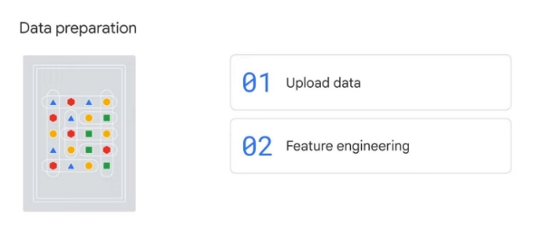
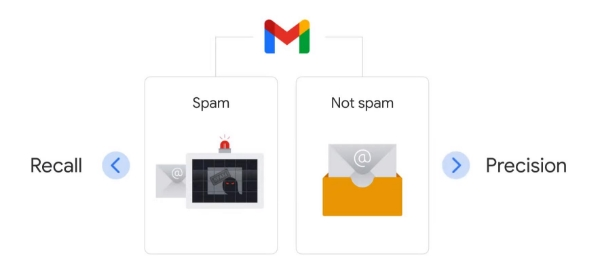

# Le flux de travail d'apprentissage automatique avec Vertex AI

Dans la section précédente de ce cours, vous avez exploré les options de machine learning disponibles

sur Google Cloud.

Maintenant, concentrons-nous sur le flux de travail d'apprentissage automatique avec Vertex AI - de

la préparation des données à la formation des modèles et enfin au déploiement des modèles.

Vertex AI, la plate-forme d'IA de Google, fournit aux développeurs et aux data scientists un

environnement unifié pour créer des modèles ML personnalisés.

Ce processus n'est en fait pas trop différent de servir de la nourriture dans un restaurant - en commençant

par la préparation des ingrédients crus jusqu'au service des plats sur la table.

Plus loin dans cette section, vous vous exercerez à créer un modèle d'apprentissage automatique

de bout en bout à l'aide d'AutoML sur Vertex AI.

Mais avant d'entrer dans les détails, examinons les différences fondamentales entre l'apprentissage automatique et la programmation traditionnelle.

En programmation traditionnelle, en termes simples, un plus un égale deux (1+1=2).

Les données, plus les règles - autrement appelées algorithmes - conduisent à des réponses.

Et avec la programmation traditionnelle, un ordinateur ne peut suivre que les algorithmes qu'un humain

a mis en place.

Mais que se passe-t-il si nous sommes trop paresseux pour comprendre les algorithmes ? Ou que se passe-t-il si les algorithmes sont trop complexes pour être compris ?

C'est là que l'apprentissage automatique entre en jeu.

Avec l'apprentissage automatique, nous alimentons une machine avec une grande quantité de données, ainsi que des réponses que

nous attendons d'un modèle qu'il conclue à partir de ces données.

Ensuite, nous montrons à la machine une méthode d'apprentissage en sélectionnant un modèle d'apprentissage automatique.

À partir de là, nous nous attendons à ce que la machine apprenne des données et des exemples fournis pour résoudre

le puzzle par elle-même.

Ainsi, au lieu de dire à une machine comment faire une addition, nous lui donnons des paires de nombres et

les réponses.

Par exemple, 1, 1 et 2, et 2, 3 et 5.

Nous lui demandons ensuite de trouver comment faire l'addition par lui-même.

Mais comment est-il possible qu'une machine puisse réellement apprendre à résoudre des énigmes ?

Pour que l'apprentissage automatique réussisse, vous aurez besoin de beaucoup de stockage, comme ce qui est disponible

avec Cloud Storage, et de la capacité d'effectuer des calculs rapides, comme avec le cloud computing.

Il existe de nombreux exemples pratiques de cette capacité.

Par exemple, en alimentant Google Photos avec de nombreuses images avec des balises, nous pouvons apprendre au logiciel

à associer puis à attacher automatiquement des balises aux nouvelles images.

Les balises peuvent ensuite être utilisées pour la fonctionnalité de recherche, ou même pour créer automatiquement des albums photo.

Pouvez-vous proposer d'autres exemples pour appliquer les capacités d'apprentissage automatique ?

Prenez un moment pour y réfléchir.

Il y a trois étapes clés dans ce processus d'apprentissage.

La première étape est la préparation des données, qui comprend deux étapes : le téléchargement des données et

l'ingénierie des fonctionnalités.

Vous serez initié à l'ingénierie des fonctionnalités dans la prochaine leçon.

Un modèle a besoin d'une grande quantité de données pour apprendre.

Les données utilisées dans l'apprentissage automatique peuvent être soit des données en continu en temps réel, soit des données par lots, et

il peut être structuré, c'est-à-dire des nombres et du texte normalement enregistrés dans des tableaux, ou non structuré,

c'est-à-dire des données qui ne peuvent pas être mises dans des tableaux, comme des images et des vidéos.

La deuxième étape est la formation du modèle.

Un modèle a besoin d'une énorme quantité de formation itérative.

C'est à ce moment que la formation et l'évaluation forment un cycle pour former un modèle, puis évaluer le

modèle, puis former le modèle un peu plus.

La troisième et dernière étape est le service modèle.

Un modèle doit effectivement être utilisé afin de prédire les résultats.

C'est à ce moment que le modèle d'apprentissage automatique est déployé, surveillé et géré.

Si vous ne mettez pas un modèle ML en production, il n'a aucune utilité et ne reste qu'un

modèle théorique.

Nous avons mentionné au début que le flux de travail d'apprentissage automatique sur Vertex AI n'est pas trop

différent de servir de la nourriture dans un restaurant.

Donc, si vous comparez ces étapes à la gestion d'un restaurant, la préparation des données consiste à

préparer les ingrédients bruts, la formation au modèle consiste à expérimenter différentes recettes

et le service modèle consiste à finaliser le menu pour servir le repas à de nombreux clients affamés. .

Il est maintenant important de noter qu'un flux de travail ML n'est pas linéaire, il est itératif.

Par exemple, pendant la formation du modèle, vous devrez peut-être revenir pour creuser dans les données brutes et

générer des fonctionnalités plus utiles pour alimenter le modèle.

Lors de la surveillance du modèle pendant la diffusion du modèle, vous pouvez constater une dérive des données ou la précision

de votre prédiction pourrait chuter soudainement.

Vous devrez peut-être vérifier les sources de données et ajuster les paramètres du modèle. Heureusement, ces étapes peuvent être automatisées avec des opérations d'apprentissage automatique, ou MLOps.

Nous reviendrons plus en détail à ce sujet bientôt.

Alors, comment Vertex AI prend-il en charge ce flux de travail ?

Vous vous souviendrez que Vertex AI propose deux options pour créer des modèles d'apprentissage automatique :

AutoML, qui est une solution sans code, et Custom Training, qui est une solution basée sur du code.

Vertex AI fournit de nombreuses fonctionnalités pour prendre en charge le flux de travail ML, qui sont toutes accessibles

via AutoML ou Vertex AI Workbench.

Exemples : Feature Store, qui fournit un référentiel centralisé pour organiser, stocker,

et servant des fonctionnalités pour alimenter les modèles de formation, Vizier, qui vous aide à ajuster les hyperparamètres

dans des modèles d'apprentissage automatique complexes, l'IA explicable, qui aide à interpréter les performances de formation

et les comportements des modèles, et Pipelines, qui vous aide à automatiser et à surveiller la

chaîne de production ML.

## Préparation des données

Examinons maintenant de plus près un flux de travail AutoML.

La première étape du workflow AutoML est la préparation des données.

Au cours de cette étape, vous devez télécharger des données, puis préparer les données pour la formation du modèle avec

l'ingénierie des fonctionnalités.

Lorsque vous téléchargez un ensemble de données dans l'interface utilisateur de Vertex AI, vous devez fournir un

nom significatif pour les données, puis sélectionner le type de données et l'objectif.

AutoML autorise quatre types de données : image, tableau, texte et vidéo.

Pour sélectionner le type de données et l'objectif corrects, vous devez :

Commencez par vérifier les exigences en matière de données.

Nous avons inclus un lien vers ces exigences dans la section des ressources de ce cours. Ensuite, vous devrez ajouter des étiquettes aux données si vous ne l'avez pas déjà fait. Un label est un objectif de formation. Lorsque vous téléchargez un ensemble de données dans l'interface utilisateur de Vertex AI, vous devez fournir un

nom significatif pour les données, puis sélectionner le type de données et l'objectif.

AutoML autorise quatre types de données : image, tableau, texte et vidéo.

Pour sélectionner le type de données et l'objectif corrects, vous devez :

Commencez par vérifier les exigences en matière de données.

Nous avons inclus un lien vers ces exigences dans la section des ressources de ce cours. Ensuite, vous devrez ajouter des étiquettes aux données si vous ne l'avez pas déjà fait.

Un label est un objectif de formation.

Donc, si vous voulez qu'un modèle distingue un chat d'un chien, vous devez d'abord fournir des exemples d'

images qui sont étiquetées ou étiquetées soit chat soit chien.

Une étiquette peut être ajoutée manuellement ou à l'aide du service d'étiquettes payantes de Google

via la console Vertex.

Ces étiqueteurs humains généreront manuellement des étiquettes précises pour vous.

La dernière étape consiste à télécharger les données.

Les données peuvent être importées depuis une source locale, BigQuery ou Cloud Storage. Vous pratiquerez ces étapes en laboratoire.

Une fois vos données importées dans AutoML, l'étape suivante consiste à préparer les données pour

l'entraînement du modèle avec l'ingénierie des fonctionnalités.

Imaginez que vous êtes dans la cuisine en train de préparer un repas.

Vos données sont comme vos ingrédients, comme les carottes, les oignons et les tomates.

Avant de commencer la cuisson, vous devrez éplucher les carottes, hacher les oignons et rincer les

tomates.

Voici à quoi ressemble l'ingénierie des fonctionnalités : les données doivent être traitées avant que le modèle

ne commence à s'entraîner.

Une fonctionnalité, comme nous l'avons vu dans le module BigQuery, fait référence à un facteur qui contribue

à la prédiction.

C'est une variable indépendante dans les statistiques ou une colonne dans un tableau.

La préparation des fonctionnalités peut être à la fois difficile et fastidieuse.

Pour vous aider, Vertex AI a une fonction appelée Feature Store.

Feature Store est un référentiel centralisé pour organiser, stocker et servir

les fonctionnalités d'apprentissage automatique.

Il regroupe toutes les différentes fonctionnalités de différentes sources et les met à jour pour les rendre disponibles à partir d'un référentiel central.

Ensuite, lorsque les ingénieurs ont besoin de modéliser quelque chose, ils peuvent utiliser les fonctionnalités disponibles dans le

dictionnaire Feature Store pour créer un jeu de données.

Vertex AI automatise l'agrégation de fonctionnalités pour faire évoluer le processus.

Alors, quels sont les avantages de Vertex AI Feature Store ?

Premièrement, les fonctionnalités peuvent être partagées pour des tâches de formation ou de diffusion.

Les fonctionnalités sont gérées et servies à partir d'un référentiel central, ce qui permet de maintenir la cohérence

au sein de votre organisation.

Deuxièmement, les fonctionnalités sont réutilisables.

Cela permet de gagner du temps et de réduire les efforts de duplication, en particulier pour les fonctionnalités de grande valeur.

Troisièmement, les fonctionnalités sont évolutives.

Les fonctionnalités évoluent automatiquement pour fournir un service à faible latence, afin que vous puissiez vous concentrer sur le développement de la

logique pour créer les fonctionnalités sans vous soucier du déploiement.

Et quatrièmement, les fonctionnalités sont faciles à utiliser.

Feature Store est construit sur une interface utilisateur facile à naviguer.

## Model training

Maintenant que nos données sont prêtes, qui, si nous revenons à l'analogie de la cuisine, sont nos ingrédients,

il est temps de former le modèle.

C'est comme expérimenter certaines recettes.

Cette étape comporte deux étapes : la formation du modèle, qui serait comme cuisiner la recette, et

l'évaluation du modèle, qui consiste à goûter à la qualité du repas. Ce processus peut être itératif.

Avant d'entrer dans les détails de cette étape, arrêtons-nous pour clarifier deux termes :

l'intelligence artificielle et l'apprentissage automatique.

L'intelligence artificielle, ou IA, est un terme générique qui inclut tout ce qui concerne les ordinateurs

imitant l'intelligence humaine.

Par exemple, dans un traitement de texte en ligne, des robots effectuant des actions humaines jusqu'au bout

jusqu'à la vérification orthographique.

L'apprentissage automatique est un sous-ensemble de l'IA qui fait principalement référence à

l'apprentissage supervisé et non supervisé.

Vous pouvez également entendre le terme apprentissage en profondeur ou réseaux de neurones profonds.

Il s'agit d'un sous-ensemble d'apprentissage automatique qui ajoute des couches entre les données d'entrée et les résultats de sortie

pour permettre à une machine d'apprendre plus en profondeur.

Alors, quelle est la différence entre l'apprentissage supervisé et non supervisé ? L'apprentissage supervisé est axé sur les tâches et identifie un objectif.

L'apprentissage non supervisé, cependant, est axé sur les données et identifie un modèle. Un moyen facile de faire la distinction entre les deux est que l'apprentissage supervisé fournit à chaque

point de données une étiquette ou une réponse, alors que l'apprentissage non supervisé ne le fait pas.

Par exemple, si nous recevions des données sur les ventes d'un détaillant en ligne, nous pourrions utiliser

l'apprentissage supervisé pour prédire la tendance des ventes pour les deux prochains mois et utiliser l'apprentissage non supervisé pour regrouper les clients en fonction de caractéristiques communes.

Il existe deux principaux types d'apprentissage supervisé : le premier est la classification, qui prédit

une variable catégorielle, comme l'utilisation d'une image pour faire la différence entre un chat et un

chien.

Le deuxième type est un modèle de régression, qui prédit un nombre continu, comme l'utilisation

des ventes passées d'un article pour prédire une tendance future.

Il existe trois grands types d'apprentissage non supervisé :

le premier est le regroupement, qui regroupe des points de données ayant des caractéristiques similaires et

les attribue à des "clusters", comme l'utilisation des données démographiques des clients pour déterminer la segmentation des clients.

La seconde est l'association, qui identifie les relations sous-jacentes, comme une corrélation entre deux produits pour les rapprocher dans une épicerie pour une promotion.

Et le troisième est la réduction de la dimensionnalité, qui réduit le nombre de dimensions, ou caractéristiques, dans un jeu de données pour améliorer l'efficacité d'un modèle.

Par exemple, combiner les caractéristiques du client telles que l'âge, l'historique des infractions au code de la route ou

le type de voiture pour créer un devis d'assurance.

Si trop de dimensions sont incluses, cela peut consommer trop de ressources de calcul, ce qui

peut rendre le modèle inefficace.

Bien que Google Cloud propose quatre options de machine learning,

avec AutoML et les API prédéfinies, vous n'avez pas besoin de spécifier un

modèle de machine learning.

Au lieu de cela, vous définirez votre objectif, tel que la traduction de texte ou la détection d'images.

Ensuite, sur le backend, Google sélectionnera le meilleur modèle pour atteindre votre objectif commercial.

Avec les deux autres options, BigQuery ML et l'entraînement personnalisé, vous devrez spécifier

le modèle sur lequel vous souhaitez entraîner vos données et attribuer un élément appelé hyperparamètres.

Vous pouvez considérer les hyperparamètres comme des boutons définis par l'utilisateur dans une machine qui aident à guider le

processus d'apprentissage automatique.

Par exemple, un paramètre est un taux d'apprentissage, qui correspond à la vitesse à laquelle vous voulez que la machine apprenne.

Avec AutoML, vous n'avez pas à vous soucier de

ajuster ces boutons d'hyperparamètres car le réglage se produit automatiquement dans le back-end.

Ceci est en grande partie effectué par une recherche d'architecte neuronal, qui trouve le modèle le mieux adapté en

comparant les performances à des milliers d'autres modèles.

## Model evaluation

Pendant que nous expérimentons une recette, nous devons continuer à la goûter constamment pour nous assurer

qu'elle répond à nos attentes.

Il s'agit de la partie d'évaluation du modèle de l'étape de formation du modèle. Vertex AI fournit des métriques d'évaluation étendues pour aider à déterminer les performances d'un modèle.

Parmi les métriques figurent deux ensembles de mesures.

La première est basée sur la matrice de confusion, par exemple rappel et précision.

La seconde est basée sur l'importance des fonctionnalités, que nous explorerons plus tard dans cette section

du cours.

Une matrice de confusion est une mesure de performance spécifique pour

les problèmes de classification d'apprentissage automatique.

C'est un tableau avec des combinaisons de valeurs prévues et réelles.

Pour garder les choses simples, nous supposons que la sortie ne comprend que deux classes.

Explorons un exemple de matrice de confusion.

La première est une véritable combinaison positive, qui peut être interprétée comme suit : "Le modèle

a prédit positif, et c'est vrai".

Le modèle a prédit qu'il s'agit de l'image d'un chat, et c'est effectivement le cas.

L'opposé de cela est une véritable combinaison négative, qui peut être interprétée comme suit : "Le modèle

a prédit un résultat négatif, et c'est vrai".

Le modèle a prédit qu'un chien n'est pas un chat, et ce n'est pas le cas.

Ensuite, il y a une combinaison de faux positifs, également connue sous le nom d'erreur de type 1, qui peut

être interprétée comme suit : "Le modèle a prédit positif, et c'est faux".

Le modèle a prédit qu'un chien est un chat, mais ce n'est pas le cas.

Enfin, il y a la combinaison de faux négatifs, également connue sous le nom d'erreur de type 2, qui peut

être interprétée comme suit : "Le modèle a prédit négatif, et c'est faux". Le modèle a prédit qu'un chat n'est pas un chat, mais il l'est en réalité.

Une matrice de confusion est à la base de nombreuses autres métriques utilisées pour évaluer les performances

d'un modèle d'apprentissage automatique.

Jetons un coup d'œil aux deux métriques populaires, le rappel et la précision, que vous rencontrerez

en laboratoire.

Le rappel fait référence à tous les cas positifs et examine combien ont été prédits correctement.

Cela signifie que le rappel est égal aux vrais positifs, divisés par la somme des vrais positifs et des faux négatifs.

La précision fait référence à tous les cas prédits comme positifs et au nombre de cas réellement positifs.

Cela signifie que la précision est égale aux vrais positifs, divisés par la somme des

vrais positifs et des faux positifs.

Imaginez que vous pêchez avec un filet.

À l'aide d'un large filet, vous avez attrapé à la fois des poissons et des rochers : 80 poissons sur 100 poissons au total dans le

lac, plus 80 rochers.

Le rappel dans ce cas est de 80%, qui est calculé par le nombre de poissons capturés, 80, divisé

par le nombre total de poissons dans le lac, 100.

La précision est de 50%, qui est calculée en prenant le nombre de poissons capturés , 80, et

en le divisant par le nombre de poissons et de roches collectés, 160.

Supposons que vous souhaitiez améliorer la précision, vous êtes donc passé à un filet plus petit.

Cette fois, vous avez attrapé 20 poissons et 0 rochers.

Le rappel devient 20% (20 poissons sur 100 collectés)

et la précision devient 100% (20 poissons et roches collectés sur 20).

La précision et le rappel sont souvent un compromis.

Selon votre cas d'utilisation, vous devrez peut-être optimiser l'un

ou l'autre.

Considérez un modèle de classification où Gmail sépare les e-mails en deux catégories : spam

et non-spam.

Si l'objectif est d'attraper autant de spams potentiels que possible, Gmail peut vouloir donner la priorité au rappel.

En revanche, si l'objectif est de ne capturer que les messages qui sont définitivement du spam sans

bloquer les autres e-mails, Gmail peut vouloir donner la priorité à la précision.

Dans Vertex AI, la plateforme visualise la précision et la courbe de rappel afin qu'elles puissent

être ajustées en fonction du problème à résoudre.

Vous aurez l'occasion de vous entraîner à ajuster la précision et le rappel dans l'atelier AutoML.

Outre la matrice de confusion et les métriques générées pour mesurer l'efficacité du modèle, telles que le rappel et la précision, l'autre mesure utile est l'importance des caractéristiques.

Dans Vertex AI, l'importance des caractéristiques est affichée dans un graphique à barres pour illustrer comment chaque

caractéristique contribue à une prédiction.

Plus la barre est longue, ou plus la valeur numérique associée à une caractéristique est grande, plus

elle est importante.

Ces informations aident à décider quelles fonctionnalités sont incluses dans un modèle d'apprentissage automatique pour

prévoir le but.

Vous observerez également le tableau d'importance des fonctionnalités dans le laboratoire. L'importance des fonctionnalités n'est qu'un exemple de

la fonctionnalité complète d'apprentissage automatique de Vertex AI appelée IA explicable. L'IA explicable est un ensemble d'outils et de cadres permettant de comprendre et d'interpréter les prédictions

faites par les modèles d'apprentissage automatique.

## Model deployment and monitoring

Les recettes sont prêtes et il est maintenant temps de

servir le repas !

Il s'agit de la dernière étape du flux de travail d'apprentissage automatique, la diffusion de modèles.

Le modèle de service se compose de deux étapes : premièrement, le déploiement du modèle, que nous pouvons comparer

au service du repas à un client affamé, et deuxièmement, la surveillance du modèle, que nous pouvons

comparer à la vérification avec les serveurs pour s'assurer que le restaurant fonctionne efficacement.

Il est important de noter que la gestion des modèles existe tout au long de ce flux de travail pour gérer

l'infrastructure d'apprentissage automatique sous-jacente.

Cela permet aux data scientists de se concentrer sur ce qu'il faut faire, plutôt que sur la manière de le faire.

Les opérations d'apprentissage automatique, ou MLOps, jouent un rôle important.

MLOps combine le développement de l'apprentissage machine avec les opérations

et applique des principes similaires de DevOps aux modèles d'apprentissage machine, qui est l'abréviation

de développement et opérations.

MLOps vise à résoudre les défis de production liés à l'apprentissage automatique.

Dans ce cas, il s'agit de créer un système intégré d'apprentissage automatique

et de l'exploiter en production.

Ceux-ci sont considérés comme l'un des plus gros problèmes par la communauté des praticiens du ML,

car les données et le code évoluent constamment dans l'apprentissage automatique.

Pratiquer MLOps signifie plaider pour l'automatisation et la surveillance à chaque étape de la construction du système ML.

Cela signifie adopter un processus permettant l'intégration continue, la formation continue et

la livraison continue.

Qu'est-ce que les MLOps ont à voir avec la diffusion de modèles ?

Eh bien, commençons par le déploiement du modèle, qui est le moment passionnant où un modèle est

mis en œuvre.

Dans notre analogie avec le restaurant, c'est quand la nourriture est mise sur la table pour que le client

la mange !

MLOps fournit un ensemble de meilleures pratiques sur le backend pour automatiser ce processus.

Il existe trois options pour déployer un modèle d'apprentissage automatique.

La première option consiste à déployer sur un point de terminaison.

Cette option est la meilleure lorsque des résultats immédiats avec une faible latence sont nécessaires, comme faire

des recommandations instantanées basées sur les habitudes de navigation d'un utilisateur chaque fois qu'il est en ligne.

Un modèle doit être déployé sur un point de terminaison avant que ce modèle puisse être utilisé pour diffuser des prédictions en temps réel

.

La deuxième option consiste à déployer à l'aide de la prédiction par lots.

Cette option est préférable lorsqu'aucune réponse immédiate n'est requise et que les données accumulées doivent être

traitées avec une seule requête.

Par exemple, envoyer de nouvelles annonces toutes les deux semaines en fonction du comportement d'achat récent de l'utilisateur et de ce qui est actuellement populaire sur le marché.

Et la dernière option consiste à déployer à l'aide de la prédiction hors ligne.

Cette option est préférable lorsque le modèle doit être déployé dans un environnement spécifique en dehors

du cloud.

Dans le laboratoire, vous vous entraînerez à prédire avec un point de terminaison.

Passons maintenant à la surveillance du modèle.

L'épine dorsale de MLOps sur Vertex AI est un outil appelé Vertex AI Pipelines.

Il automatise, surveille et régit les systèmes d'apprentissage automatique en orchestrant le flux de travail sans serveur. Imaginez que vous êtes dans une salle de contrôle de production et que Vertex AI Pipelines affiche les

données de production à l'écran.

En cas de problème, il déclenche automatiquement des avertissements basés sur un seuil prédéfini.

Avec Vertex AI Workbench, qui est un outil de bloc-notes, vous pouvez définir votre propre pipeline.

Vous pouvez le faire avec des composants de pipeline prédéfinis, ce qui signifie que vous devez principalement spécifier

comment le pipeline est assemblé en utilisant des composants comme blocs de construction.

Et c'est avec ces deux dernières étapes, le déploiement du modèle et la surveillance du modèle, que nous

compléter notre exploration du flux de travail d'apprentissage automatique. Le restaurant est ouvert et fonctionne bien - Bon appétit !

[Hands-on 1](https://www.cloudskillsboost.google/course_sessions/3719343/labs/374797)
